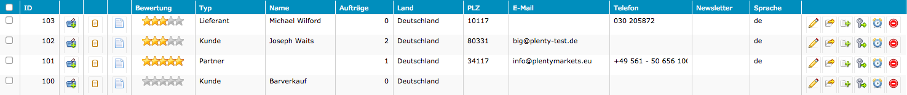
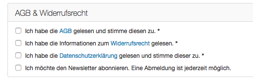

=== Fachliche und technische Beschreibung des Moduls CRM

Das CRM-Modul von plentymarkets erlaubt die zentrale Verwaltung, Speicherung und Bearbeitung von Kundendaten. Kundendatensätze, die im System gespeichert sind, können aus verschiedenen Kanälen stammen:

 * Webshop des Anwenders
 * Marktplätze
 * REST-API
 * SOAP-API
 * dynamischer Import
 * manuelle Erstellung im Backend durch den Anwender

Der Begriff _Kunden_ im plentymarkets CRM-Modul beinhaltet nicht nur natürliche Personen, sondern auch Firmen. Daher wird als Oberbegriff zukünftig sowohl auf der Benutzeroberfläche als auch in den Dokumentationen von plentymarkets der Begriff _Kontakt_ verwendet werden. Dies ist aktuell in der Umsetzungsphase. In diesem Bereich der Verfahrensdokumentation werden die Begriffe _Kunde_ und _Kontakt_ synonym verwendet.

[#200]
=== Kunden-IDs

Wenn ein neuer Kundendatensatz erstellt wird, erhält dieser eine ID. Die Kunden-ID wird durch das System vergeben. Es handelt sich hierbei um einen eindeutigen, sogenannten Auto-Increment-Wert, der vom Anwender nicht beeinflusst werden kann.

Welche Informationen im Kundendatensatz gespeichert werden können, ist im plentymarkets Handbuch auf der Seite link:https://knowledge.plentymarkets.com/crm/kundendaten-verwalten#800[Kundendaten verwalten, window="_blank"] beschrieben.

In einem neu angelegten System sind vier Beispielkundendatensätze mit den IDs 100, 101, 102 und 103 vorhanden. Ausgehend von ID 103 wird hochgezählt, wenn ein neuer Kundendatensatz erstellt wird. Der Startwert für die Kunden-IDs sowie die IDs der Kundendatensätze selbst kann nicht geändert werden.

Tabelle 1 listet die Beispielkundendatensätze mit einigen der vorausgefüllten Daten auf.

.Beispielkundendatensätze
|===
|*ID* |*Bewertung* |*Typ* |*Name* |*Aufträge*

|100
|0 von 5
|Kunde
|Barverkauf
|0

|101
|5 von 5
|Partner
|plentymarkets GmbH
|1

|102
|3 von 5
|Kunde
|Joseph Waits
|2

|103
|3 von 5
|Lieferant
|Michael Wilford
|0
|===

Öffnet der Anwender einen Kundendatensatz sind weitere Informationen sichtbar. Dazu gehören z.B. Firmenname, Adresse, E-Mail-Adresse, Telefonnummer und USt-IdNr. Bei ID 100 handelt es sich um den Barverkauf. Dem Datensatz _Barverkauf_ ist kein Kunde zugeordnet. Der Grund dafür ist, dass Aufträge, die z.B. über das plentymarkets Kassensystem im stationären Ladengeschäft oder über ein anderes Kassensystem abgewickelt werden, der ID 100 zugeordnet werden und demnach keine Kundendaten gespeichert werden.

Bild 1 zeigt die Kundenübersicht mit den bereits im System vorhandenen Beispielkundendatensätzen.

.Übersicht der Beispielkundendatensätze in einem neu angelegten System

Der Barverkauf ist – da es sich im klassischen Sinne um keinen “echten” Kunden handelt – der einzige, bereits vorhandene Datensatz in einem neuem System, bei dem keine Bewegungsdaten gespeichert sind.

Für die anderen drei Beispielkundendatensätze (IDs 101, 102 und 103) sind bereits Bewegungsdaten gespeichert. Bewegungsdaten beinhalten die folgenden Informationen:

* Datum und Uhrzeit der Registrierung im Webshop des Anwenders
* die Art, wie sich der Kunde registriert hat; d.h. regulärer Zugang oder Gastzugang (siehe Kapitel <<CRM#300, *Regulärer Zugang und Gastzugang*>>)
* Datum und Uhrzeit der letzten Aktualisierung des Kundendatensatzes
* Datum und Uhrzeit des letzten Logins
* Datum und Uhrzeit des letzten Auftrags

[#300]
=== Regulärer Zugang und Gastzugang

In plentymarkets gibt es zwei Zugangsarten für Kundendatensätze. Diese Zugangsarten sind regulärer Zugang und Gastzugang.

Bei einem regulären Zugang handelt es sich um einen Bestandskunden, der sich in der Vergangenheit im Webshop des Anwenders registriert hat und sich regelmäßig mit seinen Daten einloggt. Die reguläre Zugangsart wird außerdem auch gespeichert, wenn der Anwender einen neuen Kundendatensatz manuell, z.B während eines Telefonats mit einem Interessenten, erstellt.

Gastzugang bedeutet, dass sich der Kunde nicht registriert hat und als Gast bestellt hat. +
Ein Passwort ist nicht vorhanden; der Gastkunde kann sich daher nicht in den Mein Konto-Bereich einloggen. Es ist möglich, dass mehrere Kundendatensätze, die die identischen Daten des Gastkunden enthalten, im System gespeichert werden. Bei regulären Zugängen findet eine Überprüfung statt. Der Anwender legt fest, ob die Überprüfung anhand der E-Mail-Adresse oder zusätzlich anhand der Anschrift erfolgt.

Wenn Bestellungen über Marktplätze in das System des Anwenders eingehen, legt der Marktplatz fest, welche Zugangsart im Kundendatensatz gespeichert wird. Beispielsweise werden aktuell Kundendatensätze, die durch Amazon-Aufträge erstellt werden, als regulärer Zugang gespeichert; Kundendatensätze, die durch eBay-Aufträge erstellt werden, erhalten hingegen die Zugangsart *Gastzugang*.

Welche Zugangsart für Kundendatensätze, die von anderen in plentymarkets integrierten Marktplätze importiert wurden, vergeben wird, wird in einem anderen Bereich beschrieben.

Ob ein Kundendatensatz im System erstellt wird, hängt zudem vom verwendeten Webshop Callisto oder Ceres ab:

 * Webshop Callisto →  bei Gastbestellungen wird ein Kundendatensatz erstellt
 * Webshop Ceres →  bei Gastbestellungen wird kein Kundendatensatz erstellt. Lediglich die E-Mail-Adresse des Gastzugangs wird in der Session gespeichert. Eine Session dauert in der Regel so lange, bis der Bestellvorgang komplett abgeschlossen und damit im System eingegangen und gespeichert ist.

*Auftragszuordnung bei regulären Zugängen und Gastzugängen*

Bei regulären Zugängen wird die Anzahl der Aufträge summiert. Die Summe der Aufträge ist dann z.B. auch in der Kundenübersicht zu sehen (siehe Bild 1 in Kapitel <<CRM#200, *Kunden-IDs*>>).

Bei Gastzugängen wird die Anzahl der Aufträge nicht summiert; es wird normalerweise ein Auftrag zugeordnet. Dem Anwender ist so nicht unbedingt bekannt, wie viele Aufträge ein bestimmter Gastkunde tatsächlich im Webshop getätigt hat. Unter bestimmten Voraussetzungen können einem Gastzugang jedoch auch mehrere Aufträge zugeordnet sein: beispielsweise wenn sie nach Abschluss einer Bestellung im Webshop eine weitere Bestellung aufgeben oder sich über den Link zur Kaufabwicklung wieder einloggen. Ebenfalls denkbar sind vom Anwender manuell angelegte Aufträge, die der Kunde telefonisch direkt beim Anwender erteilt, jedoch kein Kundenkonto (regulärer Zugang) anlegen möchte.

[#400]
=== Kundentypen

Kundentypen dienen der Einordnung und Unterscheidung von Kunden. Sechs Typen sind standardmäßig in jedem System vorhanden und können nicht gelöscht werden. Jeder Typ hat eine ID. Bei dieser ID handelt es sich um einen sogenannten Auto-Increment-Wert, der durch das System vergeben wird und nicht geändert werden kann. Die folgenden Kundentypen sind standardmäßig vorhanden:

.Fest integrierte Kundentypen und deren IDs
|===
|*ID* |*Kundentyp*

|1
|Kunde

|2
|Interessent

|3
|Handelsvertreter

|4
|Lieferant

|5
|Hersteller

|6
|Partner
|===

Wenn ein neuer Kundendatensatz erstellt wird, ist automatisch der Kundentyp *Kunde* vorausgewählt. Der Anwender kann den Kundentyp jedoch nachträglich anpassen. Einem Kundendatensatz muss immer ein Kundentyp zugeordnet sein.

Abhängig von der Wahl des Kundentypen können unterschiedliche Datenfelder im Kundendatensatz eingestellt werden: Für die Kundentypen *Kunde*, *Interessent*, *Hersteller* und *Partner* sind die Datenfelder identisch. Bei Auswahl des Kundentypen *Handelsvertreter* kann der Anwender zusätzlich den PLZ-Bereich des Handelsvertreters eingeben; bei Auswahl des Kundentypen *Lieferant* kann der Anwender zusätzlich die Lieferzeit und den Mindestbestellwert eingeben.

Eine mögliche Verwendung für die Kundentypen wäre wie folgt:

Der Kundentyp *Kunde* dient zur Markierung von Kontakten, die bereits beim Anwender gekauft haben. +
Der Kundentyp *Handelsvertreter* dient zur Markierung von Kontakten, die – nach PLZ eingeteilt – Aufträgen zugewiesen werden können, um z.B. die Kundenpflege zu leisten. +
Der Kundentyp *Interessent* dient zur Markierung von Kontakten, die Kaufinteresse signalisiert haben, aber noch nicht beim Anwender haben bzw. die ein Angebot eingefordert haben, aber daraus noch keine Bestellung resultiert ist. +
Der Kundentyp *Lieferant* dient zur Markierung von Kontakten, die Waren anbieten, die vom Shopbetreiber für den Shop gekauft werden. +
Der Kundentyp *Hersteller* dient zur Markierung von Kontakten, die Artikel oder Artikelbestandteile für den Shop herstellen. +
Der Kundentyp *Partner* dient zur Markierung von Kontakten, die z.B. Wiederverkäufer sind und mit dem Shopbetreiber gesonderte Konditionen vereinbart haben.

Es ist möglich, weitere eigene Kundentypen zu definieren und der Liste der vorhandenen Kundentypen hinzuzufügen. Ausgehend von ID 6 wird hochgezählt, wenn ein neuer Kundentyp erstellt wird. Für die Kundentypen, die der Anwender hinzugefügt, stehen dieselben Datenfelder zur Verfügung wie für die Kundentypen *Kunde*, *Interessent*, *Hersteller* und *Partner*.

[#500]
=== Kundenklassen

Kundenklassen ermöglichen dem Anwender, seinen Kundenstamm nach unterschiedlichen Kriterien zu unterteilen. Beispielsweise können für Kundenklassen Mindestbestellmengen definiert, unterschiedliche Rabatte zugeordnet, Zahlungsarten festgelegt und Mengenrabatte gewährt werden. Diese Einstellungen sind dann nur für die Kundenklasse wirksam. Der Anwender kann die Kundenklasse dem Kunden im Kundendatensatz zuordnen. Die Verwendung von Kundenklassen ist optional.

Ein möglicher Anwendungsfall für eine Kundenklasse wäre die Unterteilung nach Endkunden (B2C) und Händlern (B2B). Diese Unterteilung ist sinnvoll, wenn erwünscht ist, dass die Verkaufspreise im Webshop den B2C-Kunden als Bruttopreise, den B2B-Kunden jedoch als Nettopreise angezeigt werden. Ein weiterer Anwendungsfall kann beispielsweise eine VIP-Kundenklasse für Kunden, die regelmäßig und umsatzsteigernd im Webshop bestellen, sein, um für diese Kundenklasse eigene Verkaufspreise festzulegen.

In einem neu angelegten System ist keine Kundenklasse standardmäßig vorhanden. Die vom Anwender erstellten Kundenklassen erhalten durch das System eine fortlaufende ID beginnend mit ID 1. Bei dieser ID handelt es sich um einen eindeutigen, sogenannten Auto-Increment-Wert. Der Anwender kann beliebig viele Kundenklassen erstellen. Wenn ein neuer Kundendatensatz erstellt wird, ist automatisch die Kundenklasse mit der niedrigsten ID vorausgewählt. Der Anwender kann die Kundenklasse jedoch nachträglich anpassen.

[#600]
=== Rabattsystem für Kundenklassen

Wie im Kapitel <<CRM#1100, *Kundenklassen*>> beschrieben, hat der Anwender die Möglichkeit, Kundenklassen zu erstellen und diese seinen Kunden zuzuordnen. Innerhalb der Kundenklasse besteht die Möglichkeit, einen Rabatte festzulegen. Die folgenden Rabatte können eingestellt werden:

 * Kundenklassenrabatt
 * Rabatt auf den Nettowarenwert
 * Rabatte auf die Zahlungsart
 * Rabattstaffeln

In den folgenden Unterkapiteln werden die Rabattmöglichkeiten erläutert.

[#700]
==== Kundenklassenrabatt

In einer Kundenklasse legt der Anwender einen Rabatt fest, der dann nur für die Kundenklasse wirksam wird. Darüber hinaus bestehen hier weitere Konfigurationsmöglichkeiten, z.B. die Aktivierung von Mengenrabatten der Verkaufspreise. Der Anwender sollte dabei beachten, dass sich je nach Konfiguration Rabatte addieren können.

[#800]
==== Rabattstaffel auf Nettowarenwert

Möchte der Anwender seinen Kunden Rabatte gewähren, wenn diese häufig und umsatzsteigernd im Webshop einkaufen, ist es möglich, Rabattwerte auf den Nettowarenwert des Auftrages festzulegen.

Die folgende Beschreibung bezieht sich auf den Verkauf über den Webshop. Für Verkäufe über andere Kanäle erfolgt die Beschreibung an anderer Stelle.

Der Rabatt wird berechnet und im Webshop angezeigt, wenn der Kunde seinen Einkauf beendet und zur Kasse geht. Im Warenkorb wird zunächst nur der gesamte Rabattbetrag ausgewiesen. Während des Bestellvorgangs wird zusätzlich zum Gesamtrabatt der Rabatt auf die einzelnen Artikelpositionen berechnet und angezeigt.

[#900]
==== Rabatt auf Zahlungsart

Der Rabatt auf eine Zahlungsart ist eine Art Skontoumsetzung in plentymarkets. Der Anwender gewährt Kunden damit einen Rabatt auf die Verwendung einer oder mehrerer Zahlungsarten.

[#1000]
==== Verkaufspreis als Rabatt

Der Anwender kann einen mengenbezogenen Rabatt als eigenen Preis anlegen. Der Anwender legt für den Verkaufspreis fest, ab welcher Artikelmenge der rabattierte Preis gelten soll. Eine Staffelung wird durch das Anlegen entsprechender Verkaufspreise mit den gewünschten Mindestmengen realisiert. +
Ein Kunde erhält den Rabatt, wenn er a) zu der betreffenden Kundenklasse gehört und b) mindestens die beim Verkaufspreis hinterlegte Menge bestellt.

[#1100]
=== Eigenschaften

Eigenschaften dienen einer näheren Charakterisierung von Kunden. In einem neu angelegten System ist keine Eigenschaft standardmäßig vorhanden, d.h. die Verwendung ist optional. Die vom Anwender erstellten Eigenschaften erhalten eine fortlaufende ID beginnend mit ID 1. Bei dieser ID handelt es sich um einen sogenannten Auto-Increment-Wert, der durch das System vergeben wird und nicht geändert werden kann. Der Anwender kann beliebig viele Eigenschaften erstellen.

Für die spätere Verwendung der Eigenschaften gibt es zwei Möglichkeiten: Der Anwender kann die Informationen entweder im Bestellvorgang oder in der Kundenregistrierung von seinen Kunden abfragen oder der Anwender nutzt die Eigenschaften, um selbst Informationen zu den Kunden im Kundendatensatz zu speichern.

Im Fall der Abfrage vom Kunden im Webshop bestimmt der Anwender, ob die Angabe ein Pflichtfeld ist und somit zwingend durch den Kunden eingegeben werden muss. Der Anwender kann beispielsweise bei der Registrierung abfragen, wie der Kunde auf seinen Webshop aufmerksam geworden ist.

Für jede Eigenschaft muss der Anwender einen Typen wählen. Der Typ legt fest, welche Art von Information der Anwender für die Eigenschaft eingeben kann. Diese Typen sind:

 * Zahl
 * Auswahl
 * Text einzeilig
 * Text mehrzeilig
 * Datum
 * Kundentyp

Die folgende Tabelle listet die in plentymarkets verfügbaren Typen auf. Ein Beispiel erläutert die Verwendung der Eigenschaft.

.Auswählbare Typen für die Kundeneigenschaften
|===
|*Typ* |*Beispiel*

|*Zahl*
|Der Anwender möchte von seinem Kunden wissen, in welchem Jahr der Kunde geboren ist.

|*Auswahl*
|Der Anwender möchte von seinem Kunden wissen, auf welchem Weg er den Produktkatalog zugestellt bekommen möchte. Der Anwender gibt seinem Kunden eine Vorauswahl an Antworten vor, aus welcher der Kunde wählen kann, z.B.:

|*Text einzeilig*
|Ein bestehender Kunde hat einen neuen Kunden geworben. Der Anwender möchte von seinem neuen Kunden wissen, wie die Kundennummer des bestehenden Kunden lautet.

|*Text mehrzeilig*
|Der Anwender möchte von seinem Kunden abfragen, wie der Kunde auf seinen Webshop aufmerksam geworden ist.

|*Datum*
|Der Anwender möchte das Geburtsdatum des Kunden wissen.

|*Kundentyp*
|Zur internen Nutzung des Anwenders.
|===

[#1200]
=== Im Kundendatensatz verknüpfte Daten

Im Folgenden wird in tabellarischer Form erläutert, welche Daten der Anwender aus einem Kundendatensatz heraus aufrufen kann.

.In einem Kundendatensatz verknüpfte Daten
|===
|*Im Kundendatensatz verknüpfte Informationen*|*Kurzbeschreibung*

|Eigenschaften
|Die Eigenschaften, die für die Kunden erstellt wurden, kann der Anwender speichern bzw. diese werden im Kundendatensatz angezeigt, wenn der Kunde Informationen im Webshop eingetragen hat.

|Notizen
|Es ist möglich, zu jedem Kunden Notizen zu speichern. Notizen werden nur im Backend gespeichert; d.h. diese sind im Mein Konto-Bereich des Kunden im Webshop nicht sichtbar. Notizen können gelöscht werden.

|Dokumente
|Im Kundendatensatz können Dateien, die den Kunden betreffen, hochgeladen werden. Die folgenden Dateiformate sind gültig: +
JPEG, PNG, GIF, TIFF, PDF, DOC, ODC, OTH, XLS, XML, HTML, HTM, CSS, ZIP, GZIP.

|Konto
|Der Anwender kann aus dem Kundendatensatz eine Übersicht der Umsätze des Kunden aufrufen. Somit sieht der Anwender auf einen Blick, ob es noch ausstehende Beträge gibt oder ob alle Rechnungen beglichen wurden. Außerdem werden dort weitere Aufträge, Retouren, Gutschriften etc. des Kunden angezeigt.

|Lieferanschriften
|Der Anwender kann mehrere Lieferanschriften pro Kunde eingeben und diese Lieferanschriften dann pro Auftrag individuell zuordnen. Es werden auch die Lieferanschriften, die der Kunde über seinen Mein Konto-Bereich im Webshop oder im Zuge einer Bestellung eingegeben hat, angezeigt.

|Aufträge
|Aus dem Kundendatensatz heraus kann der Anwender die Auftragsübersicht des Kunden öffnen.

|Scheduler
|Über den Scheduler werden Abonnements des Kunden angezeigt. Der Scheduler ist im Tarif Zero integraler Bestandteil. Im Tarif Classic ist der Scheduler optional und kann hinzugebucht werden.

|Tickets
|Wird das Ticketsystem genutzt, hat der Anwender die Möglichkeit, die Tickets des Kunden aus dem Kundendatensatz heraus aufzurufen. Der Anwender kann bestehende Tickets bearbeiten und neue Tickets hinzufügen.

|Events
|Ein Event kann ein Kundenanruf oder eine E-Mail an den Kunden sein. Der Anwender kann z.B. die Dauer des Telefonats eingeben, eine Information zum Vorgang wählen und einen Kommentar zum Event speichern. Es ist auch möglich, kostenpflichtige Events einzutragen und diese abzurechnen.

|Statistik
|Der Anwender kann kundenspezifische Statistiken erstellen und so bestimmte Daten speziell für diesen Kunden auswerten, z.B. den Gesamtumsatzverlauf des Kunden in einem bestimmten Zeitraum. Bestehende Statistiken können auch durch den Anwender bearbeitet werden.

|Bankdaten
|Der Anwender kann die Bankdaten des Kunden eingeben und diese bei Bedarf löschen.

|Neues Passwort
|Der Anwender kann ein neues Passwort für den Kunden eingeben. Allerdings wird dieses aus Sicherheitsgründen nicht über eine E-Mail-Vorlage, die der Anwender im Vorfeld in seinem System konfiguriert hat, versendet. (Der E-Mail-Versand über Vorlagen wird an anderer Stelle erläutert). Es wäre jedoch denkbar, dass der Anwender dem Kunden während eines Telefongesprächs das neue Passwort mitteilt.

|Login-URL
|Im plentymarkets Backend kann der Anwender die URL für einen direkten Zugang zum Mein Konto-Bereich des Kunden im Webshop aufrufen. Die URL wird gespeichert, sobald der Kunde sich mit E-Mail-Adresse und Passwort registriert hat. Eine Eingabe der Login-Daten (E-Mail-Adresse und Passwort) im Webshop ist dann nicht mehr nötig.

|Kostenstellen
|Der Anwender kann Kostenstellen anlegen. Bei einer Kostenstelle handelt es sich um den Ort der Kostenentstehung und Kostenzurechnung, quasi ein betrieblicher Bereich, der selbstständig abgerechnet wird.

|Provision
|Standardprovisionen sind für alle Kunden gültig; Artikel-Provisionen beziehen sich nur auf den Kunden, dessen Kundendatensatz gerade geöffnet ist.
|===

Weitere Informationen sind im plentymarkets Handbuch auf der Seite link:https://knowledge.plentymarkets.com/crm/kundendaten-verwalten#1300[Kundendaten verwalten, window="_blank"] zu finden.

[#1300]
=== Zahlungsarten

Der Anwender kann im Kundendatensatz einstellen, dass die Zahlungsarten *Lastschrift* und *Rechnung* für den Kunden erlaubt sind. Der Anwender kann diese Zahlungsarten individuell pro Kunde zulassen, selbst wenn die Zahlungsarten global für den Webshop nicht verwendet werden.  +
Weitere Informationen zu Zahlungsarten werden in einem anderen Bereich beschrieben.

[#1400]
=== Prüfung der Bonität und Umsatzsteueridentifikationsnummer

Der Anwender hat die Möglichkeit, die Bonität sowie die Umsatzsteueridentifikationsnummer des Kunden durch Anbindung an externe Services zu prüfen.

[#1500]
=== Kunden sperren

Der Anwender hat die Möglichkeit, Kunden zu sperren, damit diese sich nicht mehr in seinem Webshop einloggen und bestellen können. Hierbei wird der Kunde für den in seinem Kundendatensatz eingestellten Mandanten (Shop) gesperrt.

Da der Anwender festlegt, wie der Kundenlogin im Mein Konto-Bereich der Kunden erfolgen soll, wird der Kunde anhand dieser Einstellung gesperrt:

 * mittels E-Mail-Adresse und Passwort oder
 * mittels Kunden-ID und Passwort.

[#1600]
=== Unbezahlte Aufträge von Kunden einsehen

Der Anwender kann eine Liste der Kunden mit unbezahlten Aufträgen aufrufen. Die Liste enthält die Anzahl der offenen Posten eines Kunden sowie die Höhe der Forderung, die sich aus den offenen Posten ergibt.

Die Liste der offenen Posten aktualisiert sich einmal täglich automatisch. Daher kann es vorkommen, dass Forderungen teilweise erst am nächsten Tag in der Liste angezeigt werden. Der Anwender hat die Möglichkeit, die Liste manuell zu aktualisieren. Außerdem kann der Anwender die Liste durch Verwendung der folgenden Filter eingrenzen:

 * Zugangsart, d.h. ob es sich um einen Gastzugang oder einen regulären Zugang handelt
 * Anzahl der offenen Posten oder Höhe der Forderung
 * Land
 * Kundenklasse
 * Kundentyp

[#1700]
=== Zustimmung zur Speicherung von datenschutzrelevanten Informationen

Welche datenschutzrelevanten Informationen im System gespeichert werden, hängt davon ab, welche Felder der Anwender als Pflichtangaben einstellt und welche Informationen der Kunde zusätzlich bei freiwillig auszufüllenden Feldern bei der Registrierung im Webshop angibt. Neben Name, Anschrift, Telefonnummer und E-Mail-Adresse, die für eine Zuordnung zu einer Person dienen können, ist z.B. noch die Speicherung der Bankdaten möglich. In Aufträgen kann z.B. noch die IP-Adresse, über die der Auftrag erstellt wurde, abgerufen wurde. Ebenso wird das Datum und die Uhrzeit des letzten Login gespeichert.

Ein möglicher Fall wäre auch, dass der Anwender beispielsweise in der Datenschutzerklärung beschreibt, in welcher Form und für welche Dauer die Daten des Kunden gespeichert werden und dass die Daten nicht an Dritte weitergegeben werden. Außerdem legt der Anwender in seinem Webshop fest, dass das Lesen der Datenschutzerklärung und die anschließende Zustimmung zwingend notwendig ist. Das bedeutet, der Kunde muss während der Registrierung im Webshop eine Checkbox aktivieren und stimmt somit bewusst der Speicherung seiner Daten zu.

.Beispiel der Pflichtfelder (mit * gekennzeichnet) im Webshop

[#1800]
=== Speicherung von marktplatzspezifischen Kundendaten

Bei einigen Marktplätzen muss der Kunde der Weitergabe seiner Daten an ein Drittsystem zustimmen. Weitere Informationen dazu werden in einem anderen Bereich beschrieben.

[#1900]
=== Passwörter

Es ist möglich, für alle im System gespeicherten regulären Kunden neue Passwörter zu generieren. Bei Gastkonten ist dies nicht möglich.

Wenn sich der Kunde im Webshop des Anwenders registriert, vergibt der Kunde bei der Registrierung ein Passwort für sein Konto. Der Anwender kann selbst einstellen, welche Felder bei der Registrierung Pflichtfelder sein sollen. Die Pflichtfelder werden mit einem * gekennzeichnet. Demnach stimmt der Kunde der Eingabe seiner Daten zu, da er andernfalls den Registrierungsprozess nicht abschließen könnte.

[#2000]
=== Löschung von datenschutzrelevanten Informationen

Automatische Löschungen von Kundendaten wie Name, Anschrift etc. werden vom System nicht durchgeführt. Es obliegt dem Anwender, die Daten nach einer für ihn selbst definierten Zeit zu löschen. Außerdem kann der Anwender entscheiden, ob er auf Wunsch des Kunden sämtliche vom Kunden gespeicherte Daten dem Kunden beispielsweise zum Download zur Verfügung stellt.

Wenn keine Verknüpfung zwischen einem Kundendatensatz und einem Auftrag besteht –  das heißt, der Auftrag ist archiviert – kann der Anwender den Kundendatensatz löschen. Denkbar wäre auch, dass der Kunde sich zwar registriert hat, jedoch nie eine Bestellung über seinen Zugang eingegangen ist; in diesem Fall kann der Anwender den Kundendatensatz ebenfalls löschen.

[#2100]
=== Import und Export

Der Anwender hat die Möglichkeit, Kundendaten in plentymarkets automatisch oder manuell auszutauschen. Für den Austausch von Daten zwischen dem System des Anwenders und externen Systemen steht die link:https://developers.plentymarkets.com/[REST-API, window="_blank"] zur Verfügung.

Für den manuellen Austausch von Kundendaten stehen dem Anwender die folgenden Datenformate zur Verfügung:

.Verfügbare Datenformate zu Kundendaten
|===
|*Name des Datenformats* |*Verwendungszweck*

|*Customer*
|Der Anwender kann das Datenformat verwenden, um Kundenstammdaten zu exportieren, zu bearbeiten und zu importieren.

|*CustomerSet*
|Der Anwender kann das Datenformat verwenden, um neue Kundendatensätze zu erstellen.

|*CustomerNote*
|Der Anwender kann das Datenformat verwenden, um Notizen, die im Kundendatensatz erstellt wurden, zu exportieren, zu bearbeiten und zu importieren.

|*CustomerProperty*
|Der Anwender kann das Datenformat verwenden, um gespeicherte <<CRM#1100, *Kundeneigenschaften*>> zu exportieren, zu bearbeiten und zu importieren.

|*CustomerPropertyLink*
|Der Anwender kann das Datenformat verwenden, um <<CRM#1100, *Kundeneigenschaften*>> und die für die Kunden eingegebenen Werte zu exportieren, zu bearbeiten und zu importieren.

|*CustomerNewsletter*
|Der Anwender kann das Datenformat verwenden, um Daten von Kunden, die für den Bezug von Newslettern eingetragen sind, zu exportieren, zu bearbeiten und zu importieren.
|===

Über die link:https://knowledge.plentymarkets.com/basics/datenaustausch/datenformate[Übersichtsseite der Datenformate, window="_blank"] im plentymarkets Handbuch gelangt man zu den einzelnen Datenformaten inklusive Auflistungen der vorhandenen Datenfelder und Pflichtfelder sowie ggf. Abgleichfelder und Aktionen.

[#2200]
=== Backup

Aktuell ist es für den Anwender nicht möglich, ein Backup der Kundendaten über das in plentymarkets dafür vorgesehene Menü einzuspielen.
