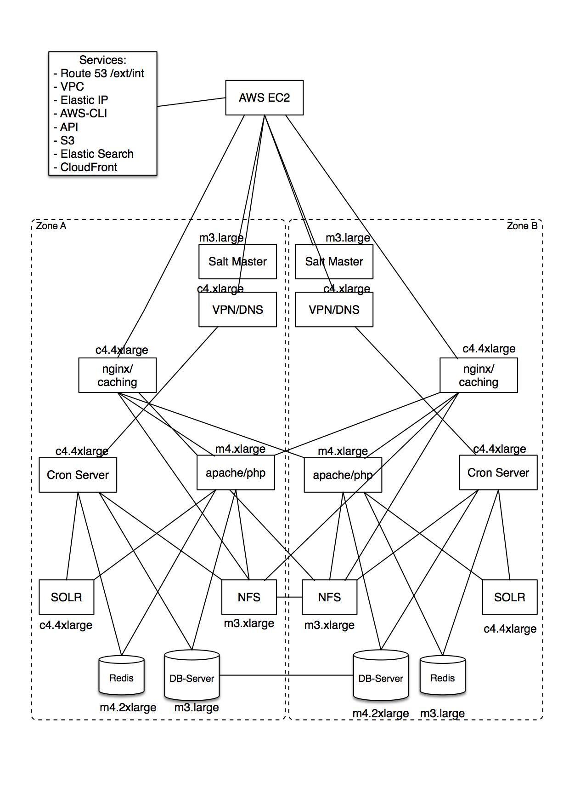

= Speicherkonzept, Löschkonzept, Aufbau, Sicherheitsarchitektur AWS Cloud
:lang: de
include::{includedir}/_header.adoc[]

== Speicherkonzept DB / NFS / S3 & Löschkonzept AWS Cloud

=== Datenbankserver

==== Allgemeines
Viele relevante Daten eines plentymarkets Kundensystems werden in Datenbankstrukturen abgelegt. Hierzu wird MariaDB (MySQL Fork) genutzt. Alle Datenbank-Server sind redundant im Master-Master Betrieb aufgestellt. Ein Zugriff auf die Datenbank-Server ist lediglich innerhalb des Clusters möglich. Ein Zugriff von außerhalb ist nicht möglich.

==== Welche Daten werden wie gespeichert?

===== Systemdaten
Die Speicherung systembezogener Daten eines plentymarkets Kundensystems erfolgt in einer eigenen Datenbank. Hier werden Daten gespeichert wie:

* Kundenname, Anschrift etc.
* Artikel (inkl. aller notwendigen Daten)
* Kategorien
* Angebundene Marktplätze
* etc.

Der Zugriff eines Kundensystems ist nur auf die dazugehörige jeweilige Datenbank möglich. Ein Zugriff auf „fremde“ Datenbanken ist aufgrund der Rechtevergabe nicht möglich.

===== Kundendaten
Die eigentlichen Kundendaten wie z. B.:

* Kundenname
* Anschrift
* Kundenklasse 
* etc.

und einige Kundensystemdaten wie z. B.:

* Domains
* IP-Adressen
* Speicherort für DB und NFS etc. 

werden in einer zentralen Datenbank gespeichert, auf die nur das Mastersystem von plentymarkets zugreifen kann. Diese Daten werden zur Verwaltung der Kundensystem genutzt.

==== Verschlüsselung
Eine generelle Verschlüsselung der Datenbanken besteht nicht. Lediglich Tabellenspalten mit Passwörtern werden als HASH gespeichert.

=== NFS-SERVER

==== Allgemeines
Andere Daten eines plentymarkets Kundensystems werden in Filestrukturen abgelegt. Hierzu wird das Netzwerkprotokoll NFS genutzt. Alle NFS-Server sind redundant aufgestellt. Ein Zugriff auf die NFS-Server ist lediglich innerhalb des Clusters möglich. Ein Zugriff von Außerhalb ist nicht möglich.

==== Welche Daten werden wie gespeichert?

===== Systemdaten
Die Speicherung der Daten eines plentymarkets Kundensystems erfolgt u.a. auf NFS-Servern. Hier werden z.B. Daten wie
Konfigurations-Dateien für das Kundensystem selbst gespeichert.

Der Zugriff eines Kundensystems ist nur auf das dazugehörige Kundenverzeichnis möglich. Ein Zugriff auf ein „fremdes“ Kundenverzeichnis ist aufgrund der Struktur und Rechtevergabe nicht möglich.

===== Kundendaten
Einige kundenbezogene Daten aus der Datenbank werden in eine oder mehrere Dateien auf dem NFS-Server geschrieben. Diese werden in dem jeweiligen Kundeverzeichnis abgelegt.

=== Amazon S3

==== Allgemeines
Andere Daten eines plentymarkets Kundensystems werden in Filestrukturen abgelegt. Hierzu wird der Amazon S3 Dienst genutzt. Alle S3-Server sind redundant aufgestellt. Ein Zugriff auf die S3-Server ist lediglich innerhalb der Cloud möglich. Ein Zugriff von außerhalb ist nicht möglich.

=== Welche Daten werden wie gespeichert?
Die Speicherung der Daten eines plentymarkets Kundensystems erfolgt u.a. auf Amazon S3-Servern. Hier werden Daten gespeichert wie:

* Layoutdateien zu dem Onlineshop (Bilder, CSS etc.) (Public)
* PDF-Dokumente (Rechnungen, Gutschriften etc.) (Private).

Der Zugriff eines Kundensystems ist nur auf die dazugehörige Kundenbuckets möglich. Ein Zugriff auf ein „fremdes“ Kundenbuckets ist aufgrund der Struktur und Rechtevergabe nicht möglich.

=== Amazon Cloud Front
Um die Ausfallsicherheit und die Auslieferungszeit von statischen Inhalten wie z.B. Bildern, CSS, JS und PDF-Dateien weiter zu verbessern werden diese über der Amazon Cloud Front Dienst (CDN) ausgeliefert.

=== Backup-Server
Alle oben genannten Kernsysteme sind wie erwähnt redundant ausgelegt. Zusätzlich werden alle Datenbank- und NFS-Daten auf 4 Backup-Servern gesichert. Die Datenbank-Daten werden täglich, die NFS-Daten werden einmal wöchentlich (Sonntagnacht) gesichert.

=== Recovery
Die Kunden habe die Möglichkeit Backups selbstständig über den Admin-Bereich (Grundeinstellungen => Backups) wieder einzuspielen. Eine Anleitung zum Einspielen der Backups ist im Handbuch unter folgender Adresse: https://knowledge.plentymarkets.com/basics/arbeiten-mit-plentymarkets/backup zu erreichen. Bei Bedarf spielt die Administration Backups oder Teile von Backups wieder ein. 

=== Löschung

==== Systemdaten
Systemdaten (Datenbank, NFS-Daten und S3-Daten) werden 30 Tage nach Ablauf des Vertrages des plentymarkets Systems zur Löschung freigegeben. Hierbei hat der Kunde 30 Tage nach Ablauf Zeit seinen Vertrag zu reaktivieren, ohne das dass System aufwändig wiederhergestellt werden muss.
Im Anschluss werden alle Systemdaten auf den Backup-Servern gesichert, und anschließend von den Produktiv-Servern gelöscht. Die gesicherten Daten werden weitere 30 Tage aufbewahrt und anschließend endgültig gelöscht. Dabei findet keine sichere Löschung der Daten statt. Allerdings wird der freigewordenen Speicherplatz sofort mit neuen Daten überschrieben, sodass Systemdaten nicht wiederhergestellt werden können.

==== Kundendaten
Löschungen von Kundendaten (Name, Anschrift etc.) werden aktuell nicht durchgeführt.

== AWS Aufbau

=== Allgemein

_Bild 1: Aufbau AWS_

=== Serverstandorte AWS Cloud

==== Neusysteme
Für Neukunden stehen die Standorte “Amazon Frankfurt” sowie “Amazon Dublin” zur Auswahl. Dementsprechend werden die Daten auch nur an dem jeweiligen Standort gespeichert.

==== Bestandssysteme
Bestandskunden steht das Cluster am Standort Frankfurt zur Verfügung.

== Sicherheitsarchitektur

=== Allgemein
Plentymarkets ist durch den TÜV „Geprüfte Cloud-Sicherheit“ zertifiziert. Die Sicherheitsarchitektur entspricht dem aktuellen Stand der Technik. 
