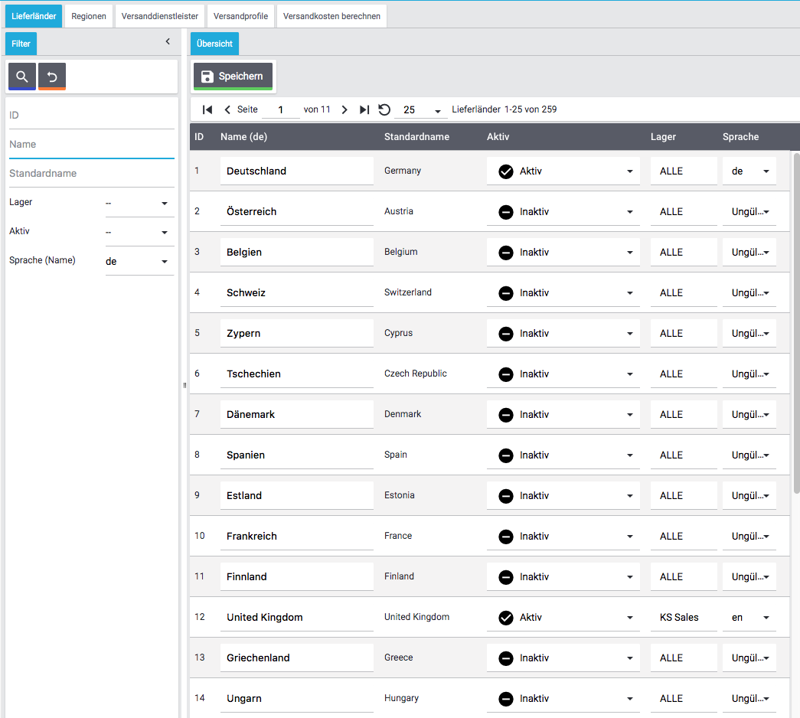
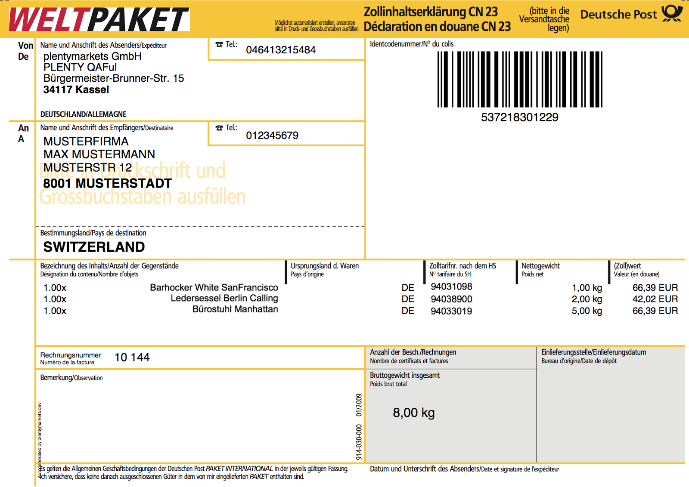

[#100]
=== Fachliche und technische Beschreibung Versandabwicklung

Für die Versandabwicklung bietet das plentymarkets System für verschiedene Versanddienstleister und Fulfillment-Dienstleister direkte Anbindungen über eine integrierte Schnittstelle oder auch über Polling-Formate an. Eine Polling-Datei wird benötigt, wenn keine direkte Schnittstelle zu der Software des Versanddienstleisters besteht. Der Anwender generiert die Polling-Datei, die die anzumeldenden Aufträge enthält, und lädt diese in der Software des Versanddienstleisters hoch, um die Versandanmeldung anzustoßen.

Außerdem besteht die Möglichkeit, andere Versanddienstleister und Fulfillment-Dienstleister über ein Plugin anzubinden. Weitere Informationen zu Plugins sind auf dem link:https://marketplace.plentymarkets.com/[plentyMarketplace] zu finden.

Im Gegensatz zu einem Versanddienstleister, über den der Anwender seine Ware lediglich anmeldet und versendet, beinhaltet das Versenden der Waren mit einem Fulfillment-Dienstleister die komplette oder teilweise Verwaltung des Warenbestands des Anwenders inklusive Lagerung der Artikel.

Eine Übersicht über die im System fest integrierten Schnittstellen zu Dienstleistern ist in den folgenden Kapiteln zu finden: <<versandabwicklung#1200, *In plentymarkets integrierte Versanddienstleister*>> und <<versandabwicklung#1300, *In plentymarkets integrierte Fulfillment-Dienstleister*>>.

Bevor der Anwender die Schnittstelle zu einem Versanddienstleister bzw. Fulfillment-Dienstleister vollumfänglich nutzen kann, muss dieser sich direkt bei dem Dienstleister registrieren.

[#200]
==== Lieferländer

In einem neu angelegten System sind 256 Lieferländer und deren IDs im System vorhanden.  Bei der ID handelt es sich um einen eindeutigen, sogenannten Auto-Increment-Wert, der durch das System vergeben wird. Die IDs können nicht geändert werden und die Lieferländer können nicht gelöscht werden. Dem Anwender ist es nicht möglich, eigene Lieferländer im System hinzuzufügen. Die IDs 111, 157, 167, 251 und 257 sind nicht vergeben. Der Standardname kann nicht geändert werden; der Anwender kann jedoch den Namen, wie er im Webshop seinen Kunden angezeigt werden soll, anpassen. Die Lieferländer und deren IDs sind in <<versandabwicklung#1900, *Anhang a)*>> aufgelistet.

In einem neu angelegten System sind die Lieferländer *Deutschland (ID 1)* und *United Kingdom (ID 12)* bereits aktiviert. Für das Lieferland Deutschland ist das Lager *ALLE* und die Sprache *de* standardmäßig ausgewählt; für das Lieferland United Kingdom ist das Lager *KS Sales* und die Sprache *en* standardmäßig ausgewählt. Das gewählte Lager ist dem Lieferland als Hauptlager zugeordnet und wird z.B. in Aufträgen automatisch eingestellt. Wenn die Einstellung *ALLE* gewählt wurde, werden alle Lager dem Lieferland zugeordnet; in diesem Fall wird für Aufträge automatisch das Lager mit der kleinsten ID gewählt.

Der Anwender kann die Lieferländer bei Bedarf deaktivieren, den Webshop-Namen anpassen und die Lagerauswahl ändern. Die restlichen Lieferländer sind nicht automatisch aktiv. Sie sind lediglich bereits mit dem Standardnamen angelegt und verfügen über eine ID. Damit der Anwender seine Artikel in die gewünschten Lieferländer liefern kann, muss er die Lieferländer im Vorfeld aktivieren.

Bild 1 zeigt einen Ausschnitt der ersten Übersichtsseite der Lieferländer in einem neu angelegten System.

.Ausschnitt der Übersichtsseite der Lieferländer

[#300]
==== Regionen

Unter einer Region werden Lieferländer zusammengefasst, für die gemeinsame Versandkosten gelten. Im Vorfeld sollte sich der Anwender überlegen, in wie viele und in welche Regionen sich die Lieferländer sinnvoll zusammenfassen lassen. Der Grund dafür ist, dass die Versandkosten in den Versandprofilen pro Region und nicht für jedes Lieferland gespeichert werden. Ein Lieferland kann immer nur einer Region zugeordnet werden und ist für weitere Regionen nicht mehr verfügbar.

In einem neu angelegten System ist die Region *Deutschland* mit ID 101 vorhanden. Es handelt sich bei der ID um einen eindeutigen, sogenannten Auto-Increment-Wert, der vom Anwender nicht geändert werden kann. Ausgehend von ID 101 wird hochgezählt, wenn eine neue Region erstellt wird. Der Region *Deutschland* ist bereits das Lieferland Deutschland zugeordnet. Der Anwender kann den Namen ändern und dieser Region weitere Lieferländer hinzufügen. Der Anwender kann eine Region nur löschen, wenn diese in den Versandprofilen nicht mehr verwendet wird. Die Regionen, die in diesem Bereich des Systems erstellt werden, stehen dann in der Portotabelle des Versandprofils zur Verfügung.

[#400]
==== Versanddienstleister

In einem neu angelegten System sind 23 Versanddienstleister mit ID sowie der Eintrag *undefined* mit ID 99 bereits vorhanden. Es handelt sich bei der ID um einen eindeutigen, sogenannten Auto-Increment-Wert, der vom Anwender nicht geändert werden kann. Ausgehend von ID 23 wird hochgezählt, wenn ein neuer Versanddienstleister, z.B. über ein Plugin, hinzugefügt wird. Der systeminterne Name, der Name, wie er im Warenkorb und auf der Rechnung erscheinen soll, sowie die Tracking-URL sind bereits gespeichert. Der Anwender kann die Namen sowie die Tracking-URL ändern. Außerdem kann der Anwender den Versanddienstleister löschen.

Versanddienstleister, die der Anwender in diesem Bereich der Software erstellt, sind bei Erstellung des Versandprofils dann wählbar. Das bedeutet, dass kein Versandprofil erstellt werden kann, ohne zuvor den Versanddienstleister erstellt zu haben.

Tabelle 1 listet die standardmäßig in plentymarkets vorhandenen Versanddiensleister mit deren ID auf.

.Versanddienstleister mit deren IDs
|===
|*ID* |*Versanddienstleister*

|1
|Selbstabholer

|2
|DHL

|3
|DPD

|4
|Deutsche Post

|5
|Hermes

|6
|TNT

|7
|FedEx

|8
|UPS

|9
|GLS

|10
|Post AT

|11
|Spedition

|12
|GEL Express

|13
|Trans-O-Flex

|14
|Spedition Dachser

|15
|Spedition Schenker

|16
|EMS Garantpost

|17
|Swiss Post

|18
|Royal Mail

|20
|c.b.c. logistics

|21
|NetDespatch

|22
|DHL Fulfillment

|23
|Parcelforce Worldwide

|99
|undefined

|===

[#500]
==== Versandprofil

Im Versandprofil stellt der Anwender die Versandmöglichkeiten ein, die seine Kunden in der Kaufabwicklung wählen können oder die der Webshop bestimmten Auftragsarten automatisch zuweist.

In einem neu angelegten System ist das Versandprofil *DHL versichertes Paket/insured package* mit ID 6 vorhanden. Es handelt sich bei der ID um einen eindeutigen, sogenannten Auto-Increment-Wert, der vom Anwender nicht geändert werden kann. Ausgehend von ID 6 wird hochgezählt, wenn ein neues Versandprofil erstellt wird. Das Versandprofil kann angepasst werden.

Der Anwender kann im Versandprofil einstellen, für welche Webshops und welche Auftragsherkünfte das Versandprofil gelten soll. Ebenso kann er Zahlungsarten und Kundenklassen für das Versandprofil sperren.

Außerdem kann der Anwender festlegen, für welche eBay-Konten und Listing-Typen das Versandprofil gelten soll oder ob Expressversand genutzt werden soll. Der Anwender kann für das Versandprofil auch die Nutzung der Treueprogramme durch eBay Plus und Amazon erlauben.

Wenn mehrere Versandprofile vorhanden sind, erfolgt die Zuordnung zu einem Auftrag anhand der Kategorie, die der Anwender eingestellt hat. Die niedrigste Kategorie eines Versandprofils hat immer Vorrang. Dies ermöglicht eine zusätzliche Priorisierung der Versandprofile im Warenkorb. Darüberhinaus hat der Anwender die Möglichkeit, im System ein Standardversandprofil festzulegen.

Der Anwender legt fest, welche Versandmöglichkeiten es für einen Artikel gibt, indem er das Versandprofil anlegt und in diesem Mandanten (Shops), Herkünfte und Portotabellen – diese enthalten die Versandregionen – für den Endkunden freigibt. Wichtig hierbei ist, dass der Anwender dieses Versandprofil an den entsprechenden Artikeln verknüpft.

Weitere Informationen zu den Einstellungen im Versandprofil sind im plentymarkets Handbuch auf der Seite link:https://knowledge.plentymarkets.com/fulfillment/versand-vorbereiten#1000[Versand vorbereiten^] zu finden.

[#600]
===== Artikel-Portoaufschlag

Portoaufschläge bieten sich für größere oder sperrige Artikel, deren Versand teuer ist, an. Der Anwender kann bis zu zwei Portoaufschläge direkt am Artikel eingeben. Aktiviert der Anwender dann die Einstellung für den Artikel-Portoaufschlag im Versandprofil wird dieser für die Versandkosten in Betracht gezogen.

Für den ersten Portoaufschlag wird der am Artikel eingegebene Betrag zu den Versandkosten addiert. Für den zweiten Portoaufschlag kann der Anwender einen Betrag eingegeben, der immer ab dem zweiten Artikel wirksam wird.

[#700]
===== Inselzuschlag

Viele Versanddienstleister verlangen für den Versand in Inselregionen höhere Gebühren. Diese Kosten kann der Anwender auf seine Kunde übertragen und im Versandprofil einen Inselzuschlag für den Versand seiner Ware berechnen.

Tabelle 2 listet auf, für welche Postleitzahlenbereiche der aktivierbaren Lieferländer der Inselzuschlag eingestellt werden kann:

.Postleitzahlen von Inselregionen
|===
|*ID des Lieferlandes* |*Name des Lieferlandes*|*Postleitzahl, Postleitzahlenbereich(e)*
|1 |Deutschland |18565, 25846-25849, 25859, 25863, 25869, 25929-25956, 25938, 25960-25999, 26453-26460, 26462-26486, 26533-26546, 26548, 26557-26579, 26737-26757, 27483
|10 |Frankreich |2000-20999
|15 |Italien |8010-8100 , 9010-9049 , 9070-9100, 9124, 9126, 9170
|21 |Niederlande |1156AA-1156ZZ, 1791AA-1797ZZ, 8881AA-8884ZZ, 8891AA-8897ZZ, 8899AA-8899ZZ, 9161AA-9164ZZ, 9166AA-9166ZZ
|65 |Spanien |07000-07079, 07081-07999, 20086, 35000-35079, 35081-35999, 38000-38079, 38000-38079, 38081
|255 |Helgoland |27498
|===

Die Postleitzahlen der Inselregionen sind systemseitig gespeichert. Der Anwender kann die  Postleitzahlenbereiche nicht ändern oder erweitern. Bei Aktivierung des Inselzuschlages erfolgt eine Berechnung nur, wenn die Postleitzahl im System als Inselregion erkannt wird.

[#800]
===== Portotabelle

In der Portotabelle speichert der Anwender die Versandkosten für das Versandprofil. Die Portoeinstellungen müssen für jede Region, die im Versandprofil verwendet werden soll, gespeichert werden. In der Portotabelle kann der Anwender auch die versanddienstleisterspezifischen Services einstellen.

[#900]
===== Berechnungstypen

Im System gibt es sechs voreingestellte Berechnungstypen, zwischen denen der Anwender wählen kann. Der Berechnungstyp bildet die Grundlage für die Berechnung der Versandkosten. Für alle Berechnungstypen kann der Anwender Beschränkungen, Maximalwerte und Pauschalen einstellen. Diese werden unterhalb der Tabelle aufgeführt. Tabelle 3 listet die im System verfügbaren Berechnungstypen auf.

.Mögliche Berechnungstypen für die Versandkosten
|===
|*Berechnungstyp* |*Verwendungszweck*
|Pauschal |Die vom Anwender eingegebenen Versandkosten stellen die Gesamtsumme dar; d.h. unabhängig davon, wie viele Artikel der Kunde kauft, er bezahlt nur die eingegebenen Versandkosten.
|Gewichtsabhängig |Die vom Anwender eingegebenen Versandkosten ermöglichen eine Staffelung der Portokosten nach dem Gewicht der im Auftrag enthaltenen Artikel.
|Volumenabhängig |Die vom Anwender eingegebenen Versandkosten ermöglichen eine Staffelung der Portokosten nach dem Volumen eines Artikels.
|Mengenabhängig |Die vom Anwender eingegebenen Versandkosten ermöglichen eine Staffelung der Portokosten nach Stückzahlen der Artikel.
|Preisabhängig |Die vom Anwender eingegebenen Versandkosten ermöglichen eine Staffelung der Portokosten nach Warenwert der Artikel bzw. Warenwert des Auftrags.
|Artikelporto |Die vom Anwender eingegebenen Versandkosten sind abhängig von der Anzahl der Artikel. Je nachdem, welcher Betrag für jeden weiteren Artikel eingegeben wurde, erhöhen sich die Versandkosten für jeden weiteren Artikel um diesen Betrag.
|===

*Maximalwerte*: Wird der maximal hinterlegte Wert (Volumen, Gewicht, Preis, Menge) überschritten, können keine Versandkosten ermittelt werden. Daher sollte der Anwender darauf achten, immer ein ausreichend hohes Maximum einzustellen.

*Pauschalen*: Zusätzlich kann ab einem bestimmten Warenwert ein pauschaler Versandkostenbeitrag hinterlegt werden. Erreicht die Bestellung diesen Warenwert oder wird dieser Warenwert überschritten, wird der pauschale Versandkostenbetrag berechnet - unabhängig davon, welche Werte der Anwender in den Gewichts-, Volumen- oder Mengentabellen angegeben hat.

*Beschränkungen*: Beschränkungen ermöglichen die Festlegung von Minimum- und Maximumwerten pro Versandprofil. Wenn ein Auftrag die eingegebenen Werte unter- oder überschreitet, kann das Versandprofil nicht für den Auftrag verwendet werden. Als Ausweichmöglichkeit für solche Fälle kann der Anwender ein weiteres Versandprofil erstellen, das einen an die Beschränkungen anschließenden Wertebereich bereitstellt.

[#1000]
==== Versandkosten für Preisportale

Der Anwender hat die Möglichkeit die Standardversandkosten einzustellen, die dann in Exporten zu Preisportalen ausgegeben werden können.

[#1100]
==== Integrierte Schnittstellen

In den folgenden Unterkapiteln wird aufgelistet, welche fest integrierten Schnittstellen zu Versanddienstleistern und Fulfillment-Dienstleistern bestehen.

[#1200]
===== Integrierte Versanddienstleister

Tabelle 4 listet die Versanddienstleister, zu denen eine Schnittstelle besteht oder denen man über das System eine Polling-Datei zur Verfügung stellt, auf.

.Liste der in plentymarkets integrierten Versanddienstleister
|===
|*Versanddienstleister* |*Fest integrierte Schnittstelle*|*Weitere “Unterschnittstellen”*|*Polling-Datei*
|c.b.c. logistics |Ja |Nein |Nein
|Deutsche Post |Nein |Nein | Internetmarke
|DHL |Ja |DHL Freight +
DHL Versenden (via Plugin) +
DHL Retoure Beilegeretiketten +
DHL Retoure Online +
DHL Supply Chain +
DHL UK
| DHL Easylog +
DHL plentymarkets Import
|DPD |Ja | DPD Cloud Webservice +
MyDPD Business / iloxx |DPD DELISprint
|EasyPAK |Nein |Nein | EasyPAK
|GLS Germany |Nein |Nein | GLS Gepard
|Hermes |Ja |Hermes 2-Mann-Handling +
Hermes ProfiPaketService |Hermes (Shipping Client)
|NetDespatch |Ja | Royal Mail +
UK Mail |Nein
|Parcelforce Worldwide |Nein |Nein |Parcelforce Worldwide
|Swiss Post |Ja |Nein |Nein
|UPS |Ja |Nein | UPS Worldship
|===

Möchte der Anwender eine dieser Schnittstellen nutzen, muss er sich in der Regel zunächst bei dem Versanddienstleister registrieren.

Eine Übersicht über die im System fest integrierten Schnittstellen zu Versanddienstleistern ist im Kapitel link:https://knowledge.plentymarkets.com/fulfillment/versand-vorbereiten#2500[Versanddienstleister im Überblick^] des plentymarkets Handbuchs zu finden. Über die Übersicht gelangt der Anwender in die Unterkapitel. Dort sind auch die Anleitungen zum Einrichten der Versanddienstleister zu finden.

[#1300]
=== Integrierte Fulfillment-Dienstleister

Zu den folgenden Fulfillment-Dienstleistern besteht standardmäßig eine Schnittstelle in plentymarkets:

 * DHL Fulfillment
 * IDS Logistik
 * iLOPACK
 * Fulfillment by Amazon

Möchte der Anwender eine dieser Schnittstellen nutzen, muss er sich in der Regel zunächst bei dem Fulfillment-Dienstleister registrieren.

Eine Übersicht über die im System fest integrierten Schnittstellen zu Fulfillment-Dienstleistern ist im Kapitel link:https://knowledge.plentymarkets.com/fulfillment/versand-vorbereiten#4700[Fulfillment-Dienstleister im Überblick^] des plentymarkets Handbuchs zu finden. Über die Übersicht gelangt der Anwender in die Unterkapitel. Dort sind auch die Anleitungen zum Einrichten der Fulfillment-Dienstleister zu finden.

[#1400]
==== Datenübertragung

Das System überträgt ausschließlich die Daten, die in den integrierten Schnittstellen vorhanden sind, an den Versanddienstleister bzw. den Fulfillment-Dienstleister. Die Daten werden erst bei der Versandanmeldung übertragen. Das System erhält im Erfolgsfall ein Versandlabel und eine Sendungsnummer von der Schnittstelle zurück oder die nötigen Informationen werden im System gespeichert, damit der Anwender selbst ein Versandlabel erzeugen kann. Im Fehlerfall wird ein Fehlercode ausgegeben.

DHL Fulfillment ist der einzige in plentymarkets integrierte Dienstleister, bei dem plentymarkets die Daten im 15-minütigen Abstand überträgt.

Generell werden die Adressdaten und relevante Daten zur Bestellungabwicklung wie z.B. die Auftrags-ID, Gewicht und spezifische Services gemäß Vertrag an den Dienstleister übertragen.

Die Adressdaten, sofern im Kundendatensatz gespeichert, beinhalten:

 * Vorname und Nachname
 * Firmenname
 * Straße, Hausnummer, PLZ, Ort, Land
 * Adresszusatz
 * E-Mail-Adresse
 * Telefonnummer
 * Postnummer (bei DHL)
 * Packstation/Postfiliale (bei DHL)

Für Sendungen ins Ausland, die mit DHL versendet werden, werden weitere Daten zu den Artikeln übertragen. Siehe Kapitel <<versandabwicklung#1700, *Zollinhaltserklärung für Sendungen ins Ausland*>>.

[#1500]
==== Versandmöglichkeiten über Marktplätze

Welche Versandmöglichkeiten an Marktplätze übergeben werden, ist von Marktplatz zu Marktplatz unterschiedlich. Bei Amazon beispielsweise wird lediglich die Lieferzeit in Tagen übermittelt. Das Versandprofil wird erst ermittelt, wenn der Auftrag im System eingeht. Bei eBay z.B. verhält sich dies anders: Hier werden eigene Versandprofile in den eBay-Rahmenbedingungen angelegt und diese enthalten die Versandservices von eBay, welche der Anwender im System wiederum mit den dort gespeicherten Versandprofilen verknüpfen muss.

[#1600]
==== Versandpakete

Der Anwender kann für seine Versandprozesse Versandpakete erstellen. Es ist möglich, die Größe selbst zu definieren oder vom System anhand der eingegebenen Artikeldaten berechnen zu lassen.

[#1700]
==== Zollinhaltserklärung für Sendungen ins Ausland

Sendungen ins Ausland müssen eine Zollinhaltserklärung, ein sogenanntes CN23-Dokument, und eine Paketkarte, ein sogenanntes CP 71-Dokument, beigelegt haben. Diese Dokumente sind wichtig für die Zollanmeldung, damit das Zollamt den Inhalt der Sendung kennt. Die folgende Informationen müssen auf der Zollinhaltserklärung vorhanden sein:

 * Artikelname
 * Zolltarifnummer
 * Warenwert
 * Gewicht
 * Menge
 * Herstellerland

Aktuell kann der Anwender Zollinhaltserklärungen und Paketkarten ausschließlich für DHL-Sendungen über die Schnittstelle zu DHL zu generieren. Für andere fest im System integrierte Versanddienstleister-Schnittstellen ist dies nicht möglich. In diesem Fall muss der Anwender den Versand direkt über den Versanddienstleister anmelden und nicht über die im System integrierte Schnittstelle.

Zollinhaltserklärungen und Paketkarten für DHL-Sendungen können im System erst generiert werden, wenn der Auftrag bei DHL angemeldet und eine Rechnung erzeugt wurde.

Ein Beispiel für eine Zollinhaltserklärung und eine Paketkarte für DHL sind in <<versandabwicklung#2000, *Anhang b)*>> zu finden.

[#1800]
==== Anhänge

[#1900]
===== Anhang a)

Tabelle 5 listet die im System voreingestellten und für den Anwender nicht änderbaren Ländernamen sowie deren IDs auf:

.Lieferländer mit ID
|===
|*ID* |*Name*
|1 |Germany
|2 |Austria
|3 |Belgium
|4 |Switzerland
|5 |Cyprus
|6 |Czech Republic
|7 |Denmark
|8 |Spain
|9 |Estonia
|10 |France
|11 |Finland
|12 |United Kingdom
|13 |Greece
|14 |Hungary
|15 |Italy
|16 |Ireland
|17 |Luxembourg
|18 |Latvia
|19 |Malta
|20 |Norway
|21 |Netherlands
|22 |Portugal
|23 |Poland
|24 |Sweden
|25 |Singapore
|26 |Slovakia
|27 |Slovenia
|28 |USA
|29 |Australia
|30 |Canada
|31 |China
|32 |Japan
|33 |Lithuania
|34 |Liechtenstein
|35 |Monaco
|36 |Mexico
|37 |Canary Islands
|38 |India
|39 |Brazil
|40 |Russia
|41 |Romania
|42 |Ceuta
|43 |Melilla
|44 |Bulgaria
|45 |Kosovo
|46 |Kyrgyzstan
|47 |Kazakhstan
|48 |Belarus
|49 |Uzbekistan
|50 |Morocco
|51 |Armenia
|52 |Albania
|53 |Egypt
|54 |Croatia
|55 |Maldives
|56 |Malaysia
|57 |Hong Kong
|58 |Yemen
|59 |Israel
|60 |Taiwan
|61 |Guadeloupe
|62 |Thailand
|63 |Turkey
|64 |Greece, Islands
|65 |Spain, Balearic Islands
|66 |New Zealand
|67 |Afghanistan
|68 |Aland Islands
|69 |Algeria
|70 |American Samoa
|71 |Andorra
|72 |Angola
|73 |Anguilla
|74 |Antarctica
|75 |Antigua and Barbuda
|76 |Argentina
|77 |Aruba
|78 |Azerbaijan
|79 |The Bahamas
|80 |Bahrain
|81 |Bangladesh
|82 |Barbados
|83 |Belize
|84 |Benin
|85 |Bermuda
|86 |Bhutan
|87 |Bolivia
|88 |Bosnia and Herzegovina
|89 |Botswana
|90 |Bouvet Island
|91 |British Indian Ocean Territory
|92 |Brunei Darussalam
|93 |Burkina Faso
|94 |Burundi
|95 |Cambodia
|96 |Cameroon
|97 |Cape Verde
|98 |Cayman Islands
|99 |Central African Republic
|100 |Chad
|101 |Chile
|102 |Christmas Island
|103 |Cocos Islands (Keeling Islands)
|104 |Columbia
|105 |Comoros
|106 |Congo
|107 |Congo, Democratic Republic
|108 |Cook Islands
|109 |Costa Rica
|110 |Ivory coast (Côte d'Ivoire)
|*111* |*nicht vergeben*
|112 |Cuba
|113 |Djibouti
|114 |Dominica
|115 |Dominican Republic
|116 |Ecuador
|117 |El Salvador
|118 |Equatorial Guinea
|119 |Eritrea
|120 |Ethiopia
|121 |Falkland Islands (Malvinas)
|122 |Faroe Islands
|123 |Fiji
|124 |French Guiana
|125 |French Polynesia
|126 |French Southern and Antarctic Lands
|127 |Gabon
|128 |Gambia
|129 |Georgia
|130 |Ghana
|131 |Gibraltar
|132 |Greenland
|133 |Grenada
|134 |Guam
|135 |Guatemala
|136 |Guernsey
|137 |Guinea
|138 |Guinea-Bissau
|139 |Guyana
|140 |Haiti
|141 |Heard Island and McDonald Islands
|142 |Holy See (Vatican City)
|143 |Honduras
|144 |Iceland
|145 |Indonesia
|146 |Iran
|147 |Iraq
|148 |Isle Of Man
|149 |Jamaica
|150 |Jersey
|151 |Jordan
|152 |Kenya
|153 |Kiribati
|154 |Democratic People's Republic of Korea
|155 |Republic of Korea
|156 |Kuwait
|*157* |*nicht vergeben*
|158 |Laos
|159 |Lebanon
|160 |Lesotho
|161 |Liberia
|162 |Libya
|163 |Macao
|164 |Macedonia
|165 |Madagascar
|166 |Malawi
|*167* |*nicht vergeben*
|168 |Mali
|169 |Marshall Islands
|170 |Martinique
|171 |Mauritania
|172 |Mauritius
|173 |Mayotte
|174 |Micronesia
|175 |Moldova
|176 |Mongolia
|177 |Montenegro
|178 |Montserrat
|179 |Mozambique
|180 |Myanmar
|181 |Namibia
|182 |Nauru
|183 |Nepal
|184 |Netherlands Antilles
|185 |New Caledonia
|186 |Nicaragua
|187 |Niger
|188 |Nigeria
|189 |Niue
|190 |Norfolk Island
|191 |Northern Mariana Islands
|192 |Oman
|193 |Pakistan
|194 |Palau
|195 |Palestinian National Authority
|196 |Panama
|197 |Papua New Guinea
|198 |Paraguay
|199 |Peru
|200 |Philippines
|201 |Pitcairn Islands
|202 |Puerto Rico
|203 |Qatar
|204 |Reunion
|205 |Rwanda
|206 |Saint Helena
|207 |Saint Kitts and Nevis
|208 |Saint Lucia
|209 |Saint Pierre and Miquelon
|210 |Saint Vincent and the Grenadines
|211 |Samoa
|212 |San Marino
|213 |Sao Tome and Principe
|214 |Saudi Arabia
|215 |Senegal
|216 |Serbia
|217 |Seychelles
|218 |Sierra Leone
|219 |Solomon Islands
|220 |Somalia
|221 |South Africa
|222 |South Georgia and the South Sandwich Islands
|223 |Sri Lanka
|224 |Sudan
|225 |Suriname
|226 |Spitsbergen and Jan Mayen Island
|227 |Swaziland
|228 |Syria
|229 |Tajikistan
|230 |Tanzania
|231 |Timor-Leste
|232 |Togo
|233 |Tokelau
|234 |Tonga
|235 |Trinidad and Tobago
|236 |Tunisia
|237 |Turkmenistan
|238 |Turks and Caicos Islands
|239 |Tuvalu
|240 |Uganda
|241 |Ukraine
|242 |United States Minor Outlying Islands
|243 |Uruguay
|244 |Vanuatu
|245 |Venezuela
|246 |Vietnam
|247 |Virgin Islands (British)
|248 |Virgin Islands (USA)
|249 |Wallis and Futuna
|250 |Western Sahara
|*251* |*nicht vergeben*
|252 |Zambia
|253 |Zimbabwe
|254 |United Arab Emirates
|255 |Helgoland, Germany
|256 |Büsingen, Deutschland
|*257* |*nicht vergeben*
|258 |Curaçao
|259 |Sint Maarten
|260 |BES-Inseln
|261 |Sankt Bartholomäus
|===

[#2000]
===== Anhang b)

Beispiel einer Paketkarte (CP 71) und einer Zollinhaltserklärung (CN 23) für DHL mit dem Lieferland Schweiz:

.DHL-Paketkarte (CP 71)
image::assets/DHL-Paketkarte_CP71.png[]

.DHL-Zollinhaltserklärung (CP 23)

