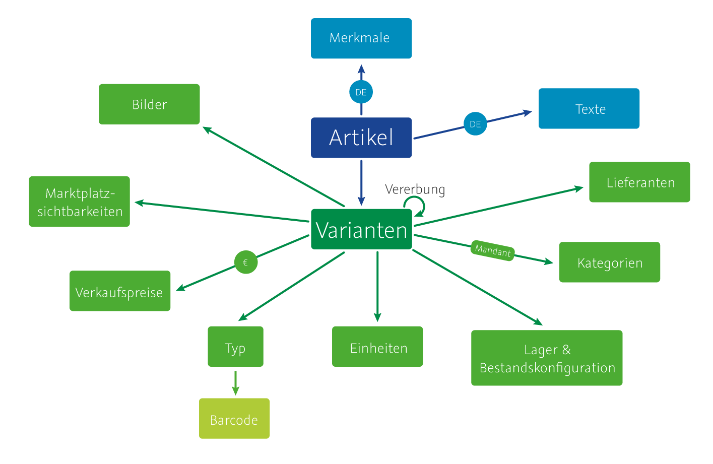

=== Fachliche und technische Beschreibung des Moduls Artikel

Die Artikelverwaltung von plentymarkets erlaubt die zentrale Verwaltung, Speicherung und Bearbeitung von Produktdaten. Produktdaten, die im System gespeichert sind, können aus verschiedenen Quellen stammen:

 * REST-API
 * SOAP-API
 * Dynamischer Import
 * Manuelle Erstellung im Backend durch Anwender
 * Plugins

Produkte werden in plentymarkets als Varianten bezeichnet. Produkte mit ähnlichen Eigenschaften, die in plentymarkets als Attribute bezeichnet werden, können von der Anwenderin als Varianten eines Artikels zusammengefasst werden.

=== Die plentymarkets Artikelstruktur

In plentymarkets gibt es zwei verschiedene Artikeltypen, Artikel des Typs Standard und Artikel des Typs Set. Da Artikel des Typs Set aktuell weder im Onlineshop noch auf Märkten zum Kauf angeboten werden können, werden hier lediglich Artikel des Typs Standard beschrieben.

Die folgende Grafik bietet einen Überblick der Artikelstruktur von plentymarkets. Die einzelnen Elemente werden nachfolgend erläutert.

Die Artikelstruktur kann stark vereinfacht in drei Datenebenen dargestellt werden:

|===
|*Datenebene*|*Erläuterung*

|Artikeleinstellungen;|Konfigurationen, die entweder mit Artikeln oder Varianten verknüpft werden
|Artikel|Datencontainer zur Verwaltung von Varianten
|Varianten|Produktebene
|===

Im Folgenden werden diese Datenebenen näher erläutert.

==== Was sind zentral verwaltete Einstellungen?

Um die Flexibilität der Artikelverwaltung zu erhöhen, werden bestimmte Konfigurationen zentral in den plentymarkets Einstellungen verwaltet und mit Artikeln oder Varianten verknüpft. Die folgenden Daten werden zentral verwaltet:

 * Einheiten
 * Barcodes
 * Verkaufspreise
 * Kategorien
 * Lieferanten
 * Attribute
 * Merkmale

==== Was ist ein Artikel?

In der plentymarkets Artikelstruktur ist ein Artikel ein Datencontainer, der aus globalen Daten und mindestens einer Hauptvariante besteht. Die globalen Daten gelten für alle Varianten des Artikels und werden als Artikeldaten bezeichnet. Wir sprechen auch davon, Daten “auf der Artikelebene” zu speichern.

Artikeldaten sind:

 * Globale Einstellungen (Zustand, Hersteller, Altersfreigabe etc.)
 * Texte (Name, Beschreibungen, technische Daten etc.)
 * Merkmale
 * Cross-Selling-Einstellungen

Jeder Artikel verfügt über eine Hauptvariante, die nicht gelöscht werden kann. Artikel können außerdem über eine beliebige Anzahl weiterer Varianten verfügen. Daten von Varianten werden als Variantendaten bezeichnet. Variantendaten werden für jede Variante getrennt gepflegt, also auf der Variantenebene.

An der Variante gespeicherte Daten sind:

 * Bilder
 * Marktplatzverfügbarkeit
 * Verkaufspreise
 * Barcodes
 * Einheiten
 * Lager
 * Bestand
 * Kategorien
 * Lieferanten

==== Was ist eine Variante?

Varianten sind verschiedene Versionen eines Artikels. Anders als Artikel, die als reiner Datencontainer dienen, handelt es sich bei Varianten um die tatsächlichen Produkte, die Kunden erwerben können. Artikel dienen dazu, Varianten mit gleichen Eigenschaften zu gruppieren und gemeinsam zu verwalten. In plentymarkets können Varianten entweder durch verschiedene Kombinationen aus Einheit und Inhalt erstellt werden oder durch den Einsatz von Attributen:

|===
|Variante|Beispiel

|Kombination aus Einheit/Inhalt|Varianten unterscheiden sich nur durch die Menge und/oder Einheit +
- Seife: 100ml, 250ml, 500ml
|Kombination aus Attributwerten|Varianten unterscheiden sich durch andere Attributwerte, z.B.: +
- Sofa: Farbe (rot, schwarz, braun) = 1 Attribut +
- Quilt: Farbe (gelb, grün), Größe (Einzel, Doppel) = 2 Attribute +
- Schuhe: Farbe (schwarz, braun), Größe (38, 39, 40), Breite (schmal, normal) = 3 Attribute
|===

Für Produktportfolios, die nicht über Produkte mit ähnlichen Eigenschaften verfügen, müssen keine Varianten erstellt werden. Da Artikel jedoch keine verkaufbaren Produkte sind, entspricht das Produkt einer Variante des Artikels, nicht dem Artikel selbst. Wenn mit mehr als einer Variante pro Artikel gearbeitet wird, kann die Hauptvariante entweder selbst ein verkaufbares Produkt sein oder ähnlich wie der Artikel rein virtuell bestehen, um die weiteren Varianten des Artikels anhand der Vererbung zu verwalten.

==== Was ist Vererbung?

Die Hauptvariante eines Artikels unterscheidet sich von den anderen Varianten eines Artikels dadurch, dass ihre Eigenschaften an die anderen Varianten des Artikels weitergegeben, also vererbt werden können. Die Hauptvariante ist also eine Elternvariante, die bestimmte Daten an ihre Kinder vererbt. Diese Vererbungsfunktion ist standardmäßig aktiviert. Wenn eine neue Variante eines Artikels erstellt wird, erbt diese Variante also standardmäßig die vererbbaren Einstellungen der Hauptvariante, wenn keine davon abweichenden Daten gespeichert werden.

Es gibt zwei Arten von Vererbung in plentymarkets: einige Einstellungen werden einzeln vererbt, andere werden gruppiert vererbt, also auf einer 1-zu-N-Basis.

===== Einzelvererbung

Einzelvererbung bedeutet, dass eine Einstellung von der Hauptvariante an die Variante vererbt wird. Die folgenden Daten werden einzeln vererbt:

 * Verfügbarkeitseinstellungen
 ** Verfügbarkeit
 ** Verfügbar wenn Netto-WB positiv
 ** Nicht verfügbar wenn kein Netto-WB
 ** Webshop: sichtbar wenn Netto-WB positiv
 ** Webshop: unsichtbar wenn kein Netto-WB
 ** Unsichtbar: in Artikelauflistung
 * Maße
 ** Länge/Breite/Höhe
 ** Gewicht brutto und netto
 ** Grundpreis anzeigen
 * Kosten
 ** Umsatzsteuer
 ** EK netto
 ** Transportkosten netto
 ** Lagerkosten netto
 ** Zoll
 ** Betriebskosten
 * Versand
 ** Kommissionierung
 ** Keine Einzelkommissionierung möglich
 ** Hauptlager
 ** KS Sales
 ** Lademittel
 ** Packstücke
 ** Portoaufschlag 1
 ** Portoaufschlag 2

===== 1-zu-N-Vererbung

1-zu-N-Vererbung bedeutet, dass die Variante entweder den vollständigen Datensatz für eine Einstellung vererbt oder keine dieser Einstellungen. Die folgenden Einstellungen werden in ihrer Gesamtheit vererbt:

 * Verkaufspreise
 * Kategorien
 * Lieferanten
 * Lager
 * Marktplätze
 * Mandantenverfügbarkeit

Die 1-zu-N-Vererbung wird automatisch aktiviert, wenn mindestens einer der vererbten Werte an der Variante geändert werden oder wenn ein Wert zur Variante hinzugefügt wird. Bei der Deaktivierung der Vererbung werden alle Einstellungen, die nicht geändert werden, an der Variante gespeichert. Wird die Vererbung wieder aktiviert, werden alle an der Variante gespeicherten Einstellungen gelöscht und durch die Werte der Hauptvariante ersetzt.

===== Vererbung bei Ändern der Hauptvariante

Der Anwender hat die Möglichkeit, eine andere Variante des Artikels zur Hauptvariante zu machen. Dabei werden die vererbbaren Werte der Hauptvariante mit den Werten der weiteren Varianten abgeglichen. Dabei bleiben alle Werte erhalten und die folgende Vererbungslogik greift:

 * Für Werte der Varianten, die mit den Werten der neuen Hauptvariante identisch sind, wird automatisch die Vererbung aktiviert.
 * Werte, die nicht mit dem Wert der neuen Hauptvariante übereinstimmen, werden direkt an der Variante gespeichert, also nicht geerbt.

=== Artikel- und Variantenverwaltung in plentymarkets

==== Artikel-ID

Jeder Artikel erhält eine systemweit eindeutige Nummer. Anwender können beim Erstellen eines Artikels eine eigene Artikel-ID wählen. Gibt die Anwenderin bei der Artikelanlage keine Artikel-ID an, wird beim Speichern des neuen Artikels automatisch die nächste verfügbare ID vergeben. Bei der automatisch vergebenen ID handelt es sich um einen eindeutigen Auto-Increment-Wert. Systemseitig können Anwenderinnen Artikel-IDs jederzeit manuell ändern. plentymarkets rät jedoch davon ab, Artikel-IDs zu ändern, da aufgrund der Komplexität der Daten und Datenverknüpfungen Folgefehler entstehen können.

Neue plentymarkets Systeme werden mit Beispielartikeln und -varianten ausgeliefert. Die Beispielartikel haben die IDs 102 bis 135.

==== Varianten-ID

Auch jeder Variante wird bei der Erstellung eine systemweit eindeutige Nummer zugeordnet. Anders als bei der Artikel-ID handelt es sich bei der Varianten-ID um einen fortlaufenden, eindeutigen Auto-Increment-Wert, der von Anwendern nicht beeinflusst und nicht im Nachhinein geändert werden kann.

Neue plentymarkets Systeme werden mit Beispielartikeln und -varianten ausgeliefert. Die Beispielvarianten haben die IDs 1000 bis 1033 sowie 1063 bis 1066.

==== Artikelverwaltung

Das Menü *Artikel » Artikel bearbeiten* bietet eine Übersicht aller Artikel- und Variantendatensätze im System. Zur Anzeige von Artikeldaten muss zunächst die Suche im Tab *Filter* ausgeführt werden. Welche Daten in der Übersicht angezeigt werden, ist von den gesetzten Filtern abhängig.

Artikel können auf verschiedene Arten erstellt und bearbeitet werden:

 * Manuell über das Menü https://knowledge.plentymarkets.com/artikel/artikel-verwalten#20[*Artikel » Artikel bearbeiten]*
 * Per dynamischem Import im Menü https://knowledge.plentymarkets.com/basics/datenaustausch/daten-importieren[*Daten » Dynamischer Import]*** **
 * Per SOAP-API
 * Per REST-API
 * Plugins

Die Artikelverwaltung wird im https://knowledge.plentymarkets.com/artikel/artikel-verwalten[plentymarkets Handbuch] detailliert beschrieben. Außer der Varianten-ID können sämtliche anderen Artikel- und Variantendaten jederzeit bearbeitet und geändert werden.

==== Sonderfall 1: Artikelpakete

Ein Artikelpaket besteht aus mehreren Produkten, die zusammengefasst und zu einem Paketpreis angeboten werden. Wie Artikelpakete erstellt werden, wird im https://knowledge.plentymarkets.com/artikel/artikel-verwalten#920[plentymarkets Handbuch] beschrieben. Wie anderen Varianten wird auch für Artikelpakete ein Verkaufspreis aktiviert und ein Preis hinterlegt.

==== Sonderfall 2: Artikelsets

Artikelsets können in plentymarkets bereits erstellt, jedoch aktuell noch nicht verkauft werden. Daher wird dieser Sonderfall in dieser Beschreibung nicht näher erläutert. Das https://knowledge.plentymarkets.com/artikel/artikel-verwalten#2080[plentymarkets Handbuch] beschreibt, wie Artikelsets angelegt und verwaltet werden.

==== Protokollierung von Artikel- und Variantendaten

Die Erstellung und Änderung von Artikel- und Variantendaten wird wie folgt protokolliert:

[cols="1,2,2"]
|===
|*Daten* |*Erstellt am* |*Letzte Änderung*

|Artikel
a|* Menü *Artikel » Artikel bearbeiten* +
* Menü *Artikel » Artikel bearbeiten » Artikel öffnen » Tab: Global*
a|* Menü *Artikel » Artikel bearbeiten* +
* Menü *Artikel » Artikel bearbeiten » Artikel öffnen » Tab: Global*

|Varianten
a|* Menü *Artikel » Artikel bearbeiten* +
* Menü *Artikel » Artikel bearbeiten » Artikel öffnen » Tab: [Varianten-ID]*
a|* Menü *Artikel » Artikel bearbeiten* +
* Menü *Artikel » Artikel bearbeiten » Artikel öffnen » Tab: [Varianten-ID]*
|===

Das Löschen von Artikeln und Varianten wird lediglich vom Anbieter des ERP-Systems plentymarkets protokolliert und kann vom Benutzer nicht im System selbst nachvollzogen werden. Auch sonstige Änderungen an Artikel- und Variantendaten werden nicht in plentymarkets protokolliert und müssen ggf. vom Anwender erfasst und dokumentiert werden. Zu diesem Zweck stehen die weiter unten beschriebenen Exporte zur Verfügung.

=== Preisverwaltung in plentymarkets

==== Was sind Verkaufspreise?

In plentymarkets wird zwischen Verkaufspreisen und Preisen unterschieden. Die Verkaufspreise sind ähnlich wie Artikel Datencontainer, die es ermöglichen, die Eigenschaften, die auf einen Preis zutreffen sollen, zentral zu verwalten. Ein Verkaufspreis ist also eine Kombination aus Einstellungen und Bedingungen, unter denen eine Variante zu einem bestimmten Preis verkauft wird.

Systemseitig werden die Verkaufspreise im Menü *System » Verkaufspreise* verwaltet. Die verfügbaren Einstellungen werden im https://knowledge.plentymarkets.com/artikel/artikel-verwalten#880[plentymarkets Handbuch] beschrieben. Der Zeitpunkt der letzten Änderung (dazu gehört auch der Zeitpunkt, zu dem der Verkaufspreis erstellt wurde), wird in der Symbolleiste des Menü *System » Verkaufspreise » Verkaufspreis öffnen* angezeigt.

In einem neu angelegten System sind standardmäßig keine Verkaufspreise angelegt. Die vom Anwender erstellten Verkaufspreise erhalten eine fortlaufende ID beginnend mit ID 1. Bei dieser ID handelt es sich um einen sogenannten Auto-Increment-Wert, der durch das System vergeben wird und nicht geändert werden kann. Anwender können beliebig viele Verkaufspreise erstellen.

==== Was sind Preise?

Im Gegensatz zu den Verkaufspreisen ist der Preis der tatsächliche monetäre Betrag, zu dem die Variante verkauft wird, wenn die durch den Verkaufspreis definierten Bedingungen erfüllt sind. Einer Variante können beliebig viele Verkaufspreise zugeordnet werden. Dazu wird an der Variante zunächst gewählt, welche Verkaufspreise mit der Variante verknüpft werden sollen. Pro Verkaufspreis wird dann ein Preis an der Variante gespeichert. Dieser Preis “greift”, d.h. wird Kunden in Rechnung gestellt, wenn die Bedingungen, die in den Verkaufspreiseinstellungen definiert sind, erfüllt sind.

Standardmäßig werden die Kombinationen aus Verkaufspreis und Preis von der Hauptvariante an die Varianten des Artikels vererbt. Das bedeutet, dass allen Varianten eines Artikels dieselben Kombinationen aus Verkaufspreis und Preis zugeordnet wird, wenn der Benutzer keine abweichenden Einstellungen an der Variante vornimmt. Sobald eine Abweichende Einstellung im Bereich Verkaufspreise der Variante vorgenommen wird, wird die Vererbung für alle Verkaufspreise aufgehoben. Wenn die Vererbung einer Variante wieder aktiviert wird, werden alle an der Variante gespeicherten Verkaufspreise und Preise durch die vererbten ersetzt.

==== Wie können Preisdaten geändert werden?

Anwender haben verschiedene Möglichkeiten, die Preise von Varianten zu ändern:

 * In der Detailansicht der Variante
 ** Durch manuelle Eingabe eines neuen Preises
 ** Durch Aktivieren oder Deaktivieren der Vererbung
 ** Bei aktivierter Vererbung: Durch Änderung eines Preises der Hauptvariante
 * Über die Varianten-Gruppenfunktion
 * Über den dynamischen Import
 * Per SOAP-API
 * Per REST-API

Preisänderungen werden in plentymarkets nicht dokumentiert. Daher müssen Händler selbst Sorge tragen, GoBD-relevante Änderungen zu erfassen und zu dokumentieren.

==== Welche Rabatte auf Preise sind möglich?

Die in plentymarkets gespeicherten Preise einer Variante können durch folgende weitere Einstellungen in anderen plentymarkets Modulen beeinflusst werden:

 * Rabatt auf Zahlungsart
 * Kategorierabatt
 * Rabatt auf Kundenklassen
 * Einlösen von Aktionsgutscheinen (wenn für “Aktionsgutschein” am Artikel *Möglich* oder *Nur mit Gutschein kaufbar* eingestellt ist)

=== Verwaltung zentral verwalteter Einstellungen

==== Einheiten

Einheiten dienen dazu, den Inhalt von Varianten zu definieren. Diese Einheiten werden zentral verwaltet. Diese Einheiten werden mit der Variante verknüpft und eine Menge dafür hinterlegt. Standardmäßig sind in neuen Systemen 52 Einheiten nach ISO-Code gespeichert. Anwender können jedoch im Menü *System » Artikel » Einheiten* auch eigene Einheiten erstellen.

Die an der Variante gespeicherte Kombination aus Inhalt und Einheit wird außerdem herangezogen, um den Grundpreis gemäß der Grundpreisverordnung zu errechnen. Der Grundpreis wird jedoch nur auf den Verkaufskanälen ausgegeben, wenn an der Variante die Option *Grundpreis anzeigen* aktiviert ist. Auch bei Produkten, die der Grundpreisverordnung unterliegen, müssen Anwender diese Einstellung selbst vornehmen.

==== Artikelkategorien

Kategorien dienen dazu, Produkte im Webshop übersichtlich zu gruppieren. Varianten können beliebig vielen Kategorien zugeordnet werden. Allerdings muss bereits bei der Erstellung eines neuen Artikels eine Standardkategorie festgelegt werden. Diese Standardkategorie kann jederzeit geändert werden, allerdings ist es technisch nicht möglich, Varianten ohne Standardkategorie zu pflegen.

Die Verwaltung von Kategorien wird im https://knowledge.plentymarkets.com/artikel/kategorien-verwalten#[plentymarkets Handbuch] erläutert.

Steuerrechtliche Relevanz haben Artikelkategorien, da in den plentymarkets Einstellungen (*Einstellungen » Mandant (Shop) » Standard » Kategorien » Rabatte*) ein oder mehrere Mengenrabatte für einzelne Artikelkategorien gespeichert werden können. Pro Kategorie sind bis zu drei Mengenrabatte möglich. Diese Rabatte werden automatisch angewendet, wenn Kunden die rabattfähige Menge an Varianten aus einer Kategorie erreichen oder überschreiten. Diese Rabatte gelten jedoch nur für die Standardkategorie einer Variante. Diese Kategorierabatte können nur manuell im plentymarkets Backend gespeichert werden, ein Import oder Export dieser Konfiguration ist nicht möglich.

==== Attribute

Attribute erlauben es Anwenderinnen, Produkteigenschaften zu abstrahieren und zentral zu verwalten. Im Menü *Einstellungen » Artikel » Attribute* können beliebig viele Attribute angelegt werden. Pro Attribut können außerdem beliebig viele Attributwerte erstellt werden. Wie weiter oben beschrieben können diese Attribute genutzt werden, um Varianten eines Artikels zu erstellen. Die Attributverwaltung wird im https://knowledge.plentymarkets.com/artikel/artikel-verwalten#390[plentymarkets Handbuch] detailliert erläutert.

Bis Version 6 von plentymarkets konnte für einen oder mehrere Attributwerte ein Aufpreis gespeichert werden, der automatisch zum Preis der Variante hinzuaddiert wurde. Seit Version 7 von plentymarkets ist diese Funktion nicht mehr verfügbar. Die Attributwerte beeinflussen also nicht den Preis einer Variante.

==== Merkmale

In plentymarkets werden passive Eigenschaften eines Artikels, die nicht dazu verwendet werden, Varianten eines Artikels zu bilden, als Merkmale bezeichnet. Über Merkmale lassen sich Features des Produkts abbilden, z.B. technische Details wie “Bluetooth” oder “WLAN”. Merkmale sind nicht an den Warenbestand gekoppelt sind.

|===
|*Merkmaltyp*|*Erläuterung*

|*Kein*|Kein Merkmaltyp
|*Ganze Zahl*|Ermöglicht die Eingabe einer ganzen Zahl im Tab *Merkmale* des Artikels, z.B. einer Größe.
|*Kommazahl*|Ermöglicht die Eingabe einer Zahl mit Kommastellen im Tab *Merkmale* des Artikels, z.B. einer Maßangabe.
|*Text*|Ermöglicht die Eingabe eines Textes im Tab *Merkmale* des Artikels.
|*Auswahl*|Ermöglicht die Erstellung einer Auswahlliste.
|*Datei*|Ermöglicht das Hochladen einer Datei im Tab *Merkmale* des Artikels.
|===

Besondere Bedeutung im Sinne der GoBD kommt Merkmalen zu, da für Merkmale ein Aufpreis definiert werden kann, der automatisch zum Preis der Varianten des Artikels hinzu addiert wird, wenn dieses Merkmal mit einem Artikel verknüpft wird. Um den Preis einer Variable inklusive Aufpreis im Webshop darzustellen, muss die Template-Variable $PriceDynamic in das Design des Webshops eingebunden werden.

Die Option *Aufpreis* kann außerdem genutzt werden, um einen Aufpreis als Zusatzkosten ohne MwSt. für den Artikel zu definieren. Hiermit können z.B. Pfandbeträge dargestellt werden. In Aufträgen werden Merkmale, bei denen die Option *Als Zusatzkosten darstellen *gewählt wurde, als eigene Position mit der *ID -2* dargestellt. +
Änderungen an Merkmalen und daraus resultierende Preisänderungen werden nicht protokolliert. Die Protokollierung solcher Änderungen obliegt dem Anwender.

==== Versandprofile

Versandprofile stellen die Versandmöglichkeiten bereit, die im Webshop angeboten werden. Die Versandprofile werden zentral verwaltet und mit Artikeln verknüpft. Das plentymarkets Konzept der Versandprofile wird im Abschnitt Versandprofile dieses Dokuments sowie im plentymarkets Handbuch erläutert.

Auf der Artikelebene ist beim Erstellen eines neuen Artikels standardmäßig kein Versandprofil aktiviert. Pro Artikel sollte jedoch mindestens ein Versandprofil aktiviert werden, da sonst ungewollte Effekte bei der Versandkostenberechnung auftreten können.

Die Versandkosten einer Variante ergeben sich also aus der Konfiguration der Versandprofile, die mit dem Artikel verknüpft sind. Um jedoch höhere Portokosten z.B. für große oder sperrige Güter zu berücksichtigen, können an der Variante ein Portoaufschlag 1 und/oder ein Portoaufschlag 2 definiert werden. Diese Aufschläge greifen nur, wenn im Versandprofil die Option *Artikel-Portoaufschlag* aktiviert ist.

==== Hersteller

Herstellerdaten werden ebenfalls zentral in den plentymarkets Einstellungen verwaltet und mit Artikeln verknüpft. Im zentralen Herstellerdatensatz werden Name, Kontaktdaten und marktplatzspezifische IDs für den Hersteller gespeichert. Jeder Hersteller erhält eine fortlaufende ID. Bei dieser ID handelt es sich um einen eindeutigen Auto-Increment-Wert, der vom Anwender nicht beeinflusst werden kann. In neuen Systemen sind keine Hersteller gespeichert, der erste vom Anwender erstellte Hersteller erhält die ID 1.

Bestimmte Hersteller erheben für den Verkauf auf bestimmten Kanälen Provisionen. Um dieser Forderung Rechnung zu tragen, kann am Hersteller ein Provisionsbetrag in Prozent gespeichert werden. Provisionen werden mandant- und herkunftsspezifisch gespeichert und

Herstellerprovisionen können nur manuell im Menü *Einstellungen » Artikel » Hersteller* hinterlegt werden. Änderungen an den Einstellungen für Herstellerprovisionen werden nicht protokolliert.

==== Preiskalkulationen

Preiskalkulationen dienen dazu, die Preise von Varianten anhand bestimmter Kriterien automatisch zu aktualisieren. Preiskalkulationen werden automatisch auf die hinterlegten Preise einer Variante angerechnet.

Preiskalkulationen werden im Menü *Einstellungen » Artikel » Preiskalkulation* gespeichert. Bei der Berechnung der Preiskalkulation können folgende an der Variante gespeicherte Daten herangezogen werden:

Der Preis, der durch Anwenden der Preiskalkulation geändert wird, ist der Verkaufspreis, der als *Preisquelle* gewählt wurde. Zu diesem Quellpreis können die folgenden Summen addiert werden:

Transportkosten = Die an der Variante gespeicherten Transportkosten werden zum Quellpreis addiert. +
Lagerkosten = Die an der Variante gespeicherten Lagerkosten werden zum Quellpreis addiert. +
Zoll = Die an der Variante gespeicherten Zollkosten werden zum Quellpreis addiert. +
Betriebskosten = Die an der Variante gespeicherten Betriebskosten werden zum Quellpreis addiert. +
MwSt. = Die an der Variante gespeicherte MwSt. wird zum Quellpreis addiert.

Über Verknüpfungen werden Preisquelle und Zusatzkosten nun mit bestimmten Verkaufspreisen verknüpft. Durch Auswahl verschiedener Kombinationen aus Mandant (Shop), Herkunft und Operator plus Operand können so sehr spezifische Preiskalkulationen erstellt werden. Änderungen, die Anwender an Preiskalkulationen vornehmen, werden nicht protokolliert. Preiskalkulationen können außerdem nur manuell im plentymarkets Backend erstellt und bearbeitet werden.

Die zentral verwalteten Preiskalkulationen werden auf Variantenebene mit Produkten verknüpft. Bei aktivierter Vererbung werden diese Preise wie andere Preise auch von der Hauptvariante an die anderen Varianten des Artikels vererbt.

Wenn die Preiskalkulation mit einer Variante verknüpft wird, wird außerdem die Herstellerprovision berücksichtigt, wenn die definierten Bedingungen zutreffen.

=== Import und Export

Anwenderinnen haben die Möglichkeit, Artikel- und Variantendaten in plentymarkets automatisch oder manuell auszutauschen. Für den Austausch von Daten zwischen dem System des Anwenders und externen Systemen steht die https://developers.plentymarkets.com[REST-API] zur Verfügung.

Für den manuellen Austausch von Artikel- und Variantendaten stehen Anwendern verschiedene Datenformate zur Verfügung. Über die https://knowledge.plentymarkets.com/basics/datenaustausch/datenformate[Übersichtsseite der Datenformate, window="_blank"] im plentymarkets Handbuch gelangt man zu den einzelnen Datenformaten inklusive Auflistungen der vorhandenen Datenfelder und Pflichtfelder sowie ggf. Abgleichfelder und Aktionen.

Die folgenden Datenformate sind im Sinne der GoBD von besonderer Bedeutung, da sie den Austausch von Preisdaten ermöglichen:

|===
|*Name des Datenformats*|*Verwendungszweck*

|Item|Import und Export von Artikeldaten
|ItemProperties|Import und Export von Merkmalverknüpfungen
|Variation|Import und Export von Variantendaten
|VariationSalesPrice|Import und Export von mit der Variante verknüpften Verkaufspreisen und Preisen
|===

=== Backup

Anwender können Backups der Artikel- und Variantendaten über das Menü *Einstellungen » Grundeinstellungen » Backup* exportieren und/oder eispielen. In dem Menü stehen Backups der letzten 7 Tage zum Download bereit. Die Backups werden als SQL-Dateien heruntergeladen.

Folgende für Artikel und Varianten relevante Daten können per Backup exportiert und/oder eingespielt werden:

*Attribute* = Attribute, Attribut-Werte und die Sprache der Attributnamen des Menüs *Einstellungen » Artikel » Attribute* +
*Category* = Die Kategorien des Menüs *Artikel » Kategorien* +
*Item* = Artikelstammdaten, vorwiegend im Tab *Global*. Es können nur bestimmte Artikeldaten wiederhergestellt werden. Verknüpfungen, z.B. Bilder, Kategorien und Attribute, werden nicht wiederhergestellt. +
*ItemDescription* = Texte von Artikeln, die im Tab *Texte* der Artikel hinterlegt wurden, also *Name*, *Name2*, *Name3*, *Kurzbeschreibung*, *Beschreibung* etc. +
*ItemFreeTextFields* = Freitextfelder von Artikeln +
*ItemListing* = Listing-Daten +
*Variation* = Variantendaten +
*VariationCategory* = Kategorieverknüpfungen der Varianten +
*VariationMarketIdentNumber* = ASINs und ePIDs +
*VariationRetailPrice* = An den Varianten gespeicherte Preise +
*VariationSupplier* = Lieferantendaten, die bei den Varianten im Tab *Lieferant* hinterlegt sind

Im https://knowledge.plentymarkets.com/basics/arbeiten-mit-plentymarkets/backup[plentymarkets Handbuch] wird beschrieben, wie Backups durchzuführen sind.

=== [_Unternehmensspezifische Informationen_]

_Nachfolgend finden Sie weitere Fragestellungen, auf die Sie in Ihrer unternehmensspezifischen Verfahrensdokumentation eingehen sollten. Diese Liste erhebt keinen Anspruch auf Vollständigkeit._

 * Wie werden Preisänderungen dokumentiert?
 * Wie werden Artikeländerungen dokumentiert?
 * Wie und von welchen Mitarbeitern werden Artikel angelegt?
