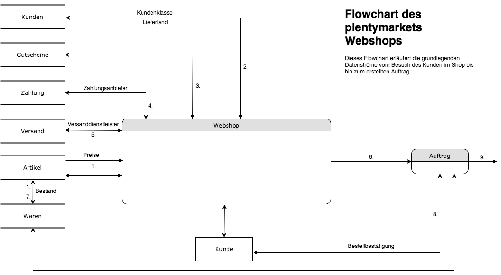

= Fachliche und technische Beschreibung des Moduls Webshop
//überarbeitet am 05.06.2024
//in der nächsten Überarbeitung wird das PWA Kapitel ausgebaut werden müssen, da die Entwicklung schnell voranschreitet

== plentyShop LTS

plentysystems stellt seinen Anwendern den vollumfänglichen Webshop *plentyShop LTS* zur Verfügung, der über die beiden Plugins plentyShop LTS und IO individualisierbar ist. Das Plugin plentyShop LTS ist für die optische und funktionale Gestaltung des Webshops zuständig. Das Plugin IO enthält die dem Webshop zugrundeliegende Logik. Beide Plugins können in der jeweils aktuellen Version über den plentyMarketplace heruntergeladen und installiert werden oder alternativ als Beta-Version über Git eingebunden werden, um Funktionalitäten bereits vor der offiziellen Veröffentlichung testen zu können.

Anwender erstellen das Design des plentyShops größtenteils über den ShopBuilder, eine Form von What-you-see-is-what-you-get-Baukastenmodul, mit dem Kunden ihre Startseite, unterschiedliche Artikelseiten (auch für Artikelpakete und -sets), Seiten für rechtliche Informationen, weitere statische Seiten, den Kundenbereich und die Kaufabwicklung erstellen können. Einstellungen, die aus technischen Gründen nicht über den ShopBuilder vorgenommen werden können, werden in den Einstellungen der beiden Plugins plentyShop LTS und IO oder in den dazugehörigen Assistenten vorgenommen. Darüber hinaus bedient sich der Webshop einer Reihe von im plentysystems System hinterlegten Informationen und Einstellungen, wie z.B. Lieferländer oder Kundenklassen.

Nach Änderungen an den Einstellungen der Plugin-Konfigurationen müssen die Plugins plentyShop LTS und IO erneut gespeichert und bereitgestellt werden, damit die vorgenommenen Änderungen im Webshop greifen. Änderungen, die mit dem ShopBuilder vorgenommen werden, sind direkt sichtbar.

== Webshop-relevante Einstellungen im plentysystems System

Einige für den Webshop relevante Einstellungen müssen im plentysystems System selbst vorgenommen werden. Dies sind konkret: 

* Die im Webshop verwendete Standardsprache, die im Menü *Einrichtung » Mandant » Mandant wählen » Aufträge* hinterlegt wird und im Webshop vorausgewählt ist.
* Die Standardversandart, die im Menü *Einrichtung » Mandant » Mandant wählen » Aufträge* hinterlegt wird und im Webshop vorausgewählt ist.
* Das Standartversandprofil, das im Menü *Einrichtung » Mandant » Mandant wählen » Aufträge* hinterlegt wird und im Webshop vorausgewählt ist.
* Die Standardzahlungsart, die im Menü *Einrichtung » Mandant » Mandant wählen » Aufträge* hinterlegt wird und im Webshop vorausgewählt ist.
* Die Standardkundenklasse, die im Menü *Einrichtung » Mandant » Mandant wählen » Aufträge* hinterlegt wird und im Webshop vorausgewählt ist.
* Das Standardlieferland, das im Menü *Einrichtung » Mandant » Mandant wählen » Aufträge* pro aktiver Webshopsprache hinterlegt wird und im Webshop vorausgewählt ist.
* Die Standardwährung, die im Menü *Einrichtung » Mandant » Mandant wählen » Aufträge* pro aktiver Webshopsprache hinterlegt wird und im Webshop für die gewählte Sprache vorausgewählt ist.

== Einstellungen am Plugin plentyShop LTS

Einstellungen am Plugin plentyShop LTS werden im Menü *Plugins » Plugin-Set-Übersicht » plentyShop LTS* getroffen. Das Tab *Konfiguration* enthält 14 weitere Tabs, die jeweils die Einstellungen für die Bereiche Startseite, Header, Footer, Artikelansicht, Warenkorb, Kontaktformular, Paginierung und Sortierung, Kaufabwicklung und Mein Konto, Sprachen, Währungen. SEO, Design und Logging und Performance enthalten. 
Alle Einstellungen, die am Plugin plentyShop LTS direkt vorgenommen werden, werden in einer eigenen Datenbank gespeichert (siehe Kapitel <<#_aws_cloud_aufbau_sicherheitsarchitektur_speicherkonzept_löschkonzept>>). Alle Einstellungen, die in den Plugin-Einstellungen getroffen werden, können auch über den plentyShop LTS-Assistenten abgewickelt werden. Dieser ist kann über das Menü *Einrichtung » Assistenten » Plugins » Plugin-Set wählen » plentyShop LTS » Mandant wählen* aufgerufen werden.

Die link:https://knowledge.plentymarkets.com/de-de/manual/main/webshop/ceres-einrichten.html[Anwenderdokumentation für plentyShop LTS^] enthält Anleitungen für alle relevanten plentyShop LTS Einstellungen.

Die link:https://knowledge.plentymarkets.com/de-de/manual/main/webshop/shop-builder.html[Anwenderdokumentation für ShopBuilder^] enthält Anleitungen für alle Vorgänge, die über den ShopBuilder abgewickelt werden.

== Einstellungen am Plugin IO

Das Plugin IO stellt die dem Webshop zugrundeliegende Logik zur Verfügung. Einstellungen am Plugin IO werden im Menü *Plugins » Plugin-Set-Übersicht » IO* getroffen. Dort werden beispielsweise Einstellungen bezüglich der verwendeten Zahlenformate und der Webshop-Routen vorgenommen.

Die link:https://knowledge.plentymarkets.com/de-de/manual/main/webshop/io-einrichten.html[Andwenderdokumentation für IO^] enthält Anleitungen für alle relevanten IO-Einstellungen.

== ShopBooster 

Der ShopBooster ist eine Zusatzfunktion für den Webshop, welcher dazu dient, die TTFB-Zeit (Time to first Byte), also die Zeit, bis der Browser die ersten Daten vom Server empfängt, deutlich zu verringern. Dies wird über sogenanntes Content-Caching erzielt: Seiteninhalte werden beim ersten Aufruf einer Seite in den Cache geschrieben und können dadurch beim erneuten Aufrufen der gleichen Seite deutlich schneller angezeigt werden. Bei aktivem ShopBooster-Modul liegt der TTFB-Wert in der Regel bei unter 100 Millisekunden. Die Daten, die in den Cache geschrieben werden, werden im File Storage Service S3 von AWS gespeichert.

// Das Abrechnungsmodell des ShopBoosters bemisst sich nach Seitenaufrufen und Seitenänderungen. Pro 100 Seitenaufrufen und -änderungen werden 0,004€ berechnet; sollten dadurch Kosten von über 100€ entstehen, werden die Kosten auf 100€ pro Monat reduziert. Ein Seitenaufruf ist der Vorgang, bei dem Shop-Besucher oder ein Webcrawler eine URL des Webshops aufruft. Eine Seitenveränderung wird durch folgende Vorgänge ausgelöst:

// * Aktualisieren von Artikel- und Kategoriedaten
// * Aktualisieren von ShopBuilder-Seiten
//* Bereitstellen von Plugins
//* Speichern von Einstellungen des Webshops
//* Invalidieren des Caches bei Deaktivierung des ShopBoosters

Der ShopBooster ist für alle plentysystems Editionen verfügbar und ist kostenlos. 
Der ShopBooster ist standardmäßig für alle Systeme aktiv.
Im Menü *Einrichtung » plentyShop » Mandanten wählen » ShopBooster* haben Kunden die Möglichkeit, die Invalidierung von Seiten für einen frei wählbaren Zeitraum auszusetzen. Ebenfalls besteht die Möglichkeit, den ShopBooster-Cache manuell zu invalidieren; diese Funktion steht Kunden allerdings nur 5 mal alle 24 Stunden zur Verfügung.

//Man aktiviert den Shopbooster im Menü *Einrichtung » Mandant » Mandant wählen » Webshop » ShopBooster* und kann ihn dort auch wieder aktivieren.

== Beispielablauf eines Einkaufs in einem plentyShop LTS Webshop 

[.instruction]
Beispielablauf:

. Der Kunde wählt im Webshop einen Artikel aus. Die Datenbank Artikel liefert Informationen wie Preis, Gewicht, etc. und stimmt die Verfügbarkeit mit der Datenbank Waren ab.
. Der Kunde meldet sich an. Die Datenbank Kunden liefert Informationen wie Kundenklasse, Rechnungsadresse, etc.
. Der Kunde verwendet einen Gutschein. Die Datenbank Gutscheine liefert die nötigen Informationen.
. Der Kunde wählt eine Zahlungsart. Die Datenbank Zahlung liefert die für die Abwicklung nötigen Informationen.
. Der Kunde wählt eine Versandart. Die Datenbank Versand liefert die für die Abwicklung nötigen Informationen.
. Der Kunde schickt die Bestellung ab. Im plentysystems System wird ein Auftrag angelegt.
. Die Datenbank Waren passt den Bestand des Artikels an.
. Der Kunde erhält eine Bestellbestätigung.
. Die weitere Bearbeitung des Auftrags erfolgt im plentysystems System.

== plentyShop PWA

plentyShop PWA ist der technische Nachfolger von plentyShop LTS und bietet einen Webshop als Progressive Web Application auf Basis des E-Commerce-Frameworks Alokai. plentyShop LTS und plentyShop PWA können nicht gleichzeitig betrieben werden. 
Im ersten Schritt wurde plentyShop PWA nur für ausgewählte Kunden freigeschaltet. 
plentyShop PWA kann bislang nicht nativ über plentysystems Systeme eingerichtet werden; es ist Entwicklungserfahrung nötig, um plentyShop PWA pdoduktiv nutzen zu können.

In unserer link:https://pwa-docs.plentymarkets.com/guide/product/[PWA Entwicklerdokumentation^] finden Interessierte alle Informationen, um plentyShop PWA zu integrieren. 